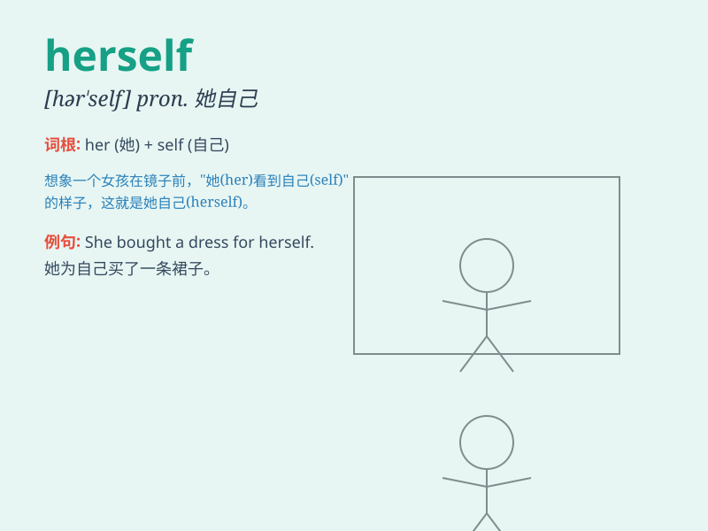

## herself

**英音:** _[hɜː\'self]_ **美音:** _[hɝ\'sɛlf]_

**译义:** * pron.她自己,她本人亲自*

### 短语

+ **by herself:** _独自；单独_

+ **for herself:** _为她自己_

+ **of herself:** _她自身的_

+ **to herself:** _对她自己_

+ **in herself:** _在她自身_

### 例句

#### 例句1

> **She did the work herself.**

**中文翻译:** 她自己做了这项工作。

**单词释义:** 她自己

#### 例句2

> **Herself was very surprised at the result.**

**中文翻译:** 她本人对结果感到非常惊讶。

**单词释义:** 她本人

#### 例句3

> **She hurt herself while playing basketball.**

**中文翻译:** 她在打篮球时伤到了自己。

**单词释义:** 她自己

### 背诵小故事

> One day, Mary was alone at home. She had to do all the chores by
herself. But she was confident and said, \'I can manage everything
myself.\' Here, \'herself\' emphasizes that Mary did things on her own.

**有一天，玛丽独自在家。她得自己做所有的家务。但她很自信地说：'我自己能搞定一切。'这里，'herself'强调玛丽独自做事情。**

### 图义

