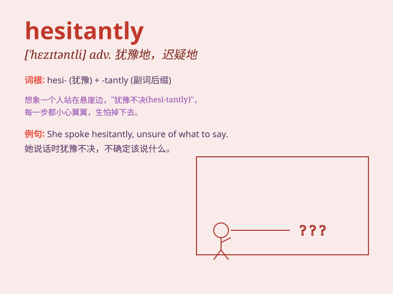

## hesitantly

**英音:** _[\'hezɪtəntli]_ **美音:** _[\'hezɪtəntli]_

**译义:** *adv.迟疑地,踌躇地*

### 短语

+ **speak hesitantly:** _说话犹豫不决_

+ **answer hesitantly:** _回答迟疑_

+ **walk hesitantly:** _走路迟疑_

+ **decide hesitantly:** _犹豫不决地决定_

+ **act hesitantly:** _行动犹豫_

### 例句

#### 例句1

> **She spoke hesitantly, unsure of how to express her thoughts.**

**中文翻译:** 她犹豫地说着，不确定如何表达自己的想法。

**单词释义:** 以犹豫的方式

#### 例句2

> **He walked hesitantly towards the stage, his heart pounding with
nerves.**

**中文翻译:** 他犹豫地走向舞台，心因紧张而砰砰直跳。

**单词释义:** 迟疑地

#### 例句3

> **The child answered the question hesitantly, fearing he might be
wrong.**

**中文翻译:** 孩子犹豫地回答问题，担心自己可能答错。

**单词释义:** 犹豫不决地

### 背诵小故事

> One day, Tom was asked to give a speech in front of the class. He
stepped forward hesitantly, not sure how well he could perform. But in
the end, he did a great job.

**有一天，汤姆被要求在全班面前演讲。他犹豫地走上前，不确定自己能表现得有多好。但最后，他做得很棒。**

### 图义

