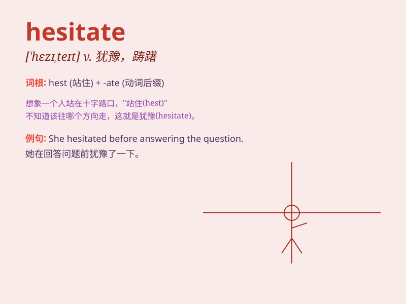

## hesitate

**英音:** _[\'hezɪteɪt]_ **美音:** _[ˈhɛzətet]_

**译义:** *v.犹豫,踌躇,不愿*

### 短语

+ **hesitate to do sth:** _对做某事犹豫不决_

+ **hesitate about:** _对\...犹豫不决_

+ **hesitate over:** _在\...上犹豫不决_

+ **without hesitate:** _毫不犹豫_

+ **hesitate in speaking:** _说话吞吞吐吐_

### 例句

#### 例句1

> **Don\'t hesitate to contact me if you need any help.**

**中文翻译:** 如果你需要任何帮助，不要犹豫，联系我。

**单词释义:** 犹豫

#### 例句2

> **She hesitated for a moment before answering the question.**

**中文翻译:** 她在回答问题前犹豫了一会儿。

**单词释义:** 犹豫

#### 例句3

> **He never hesitates when making important decisions.**

**中文翻译:** 他在做重要决定时从不犹豫。

**单词释义:** 犹豫

### 背诵小故事

> A boy wanted to confess his love to a girl but he hesitated. He
thought about what to say and worried about the result. Finally, he
gathered his courage and spoke. \'Hesitate\' means to pause or be
unsure.

**一个男孩想向一个女孩表白，但他犹豫了。他思考着要说什么，并担心结果。最后，他鼓起勇气开口了。'hesitate'意思是停顿或不确定。**

### 图义

