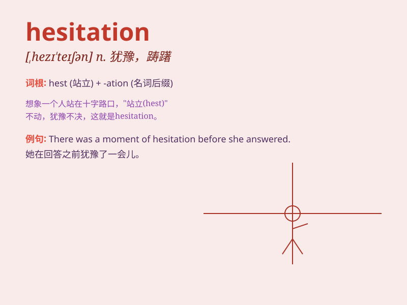

## hesitation

**英音:** _[hezɪ\'teɪʃn]_ **美音:** _[,hɛzə\'teʃən]_

**译义:** *n.犹豫,踌躇*

### 短语

+ **without hesitation:** _毫不犹豫；毫不迟疑_

+ **show hesitation:** _表现出犹豫_

+ **have hesitation:** _有犹豫_

+ **moment of hesitation:** _犹豫的时刻_

+ **overcome hesitation:** _克服犹豫_

### 例句

#### 例句1

> **She accepted the job offer without hesitation.**

**中文翻译:** 她毫不犹豫地接受了这份工作邀请。

**单词释义:** 犹豫

#### 例句2

> **There was a moment of hesitation before he answered the
question.**

**中文翻译:** 在他回答问题之前有片刻的犹豫。

**单词释义:** 犹豫

#### 例句3

> **He showed no hesitation in jumping into the river to save the
drowning child.**

**中文翻译:** 他毫不犹豫地跳进河里去救那个溺水的孩子。

**单词释义:** 犹豫

### 背诵小故事

> One day, Tom was asked to give a speech in front of the class. But he
showed hesitation, thinking about what to say. Finally, he took a deep
breath and started speaking bravely.

**有一天，汤姆被要求在全班面前演讲。但他表现出了犹豫，思考着要说什么。最后，他深吸一口气勇敢地开始了演讲。**

### 图义

