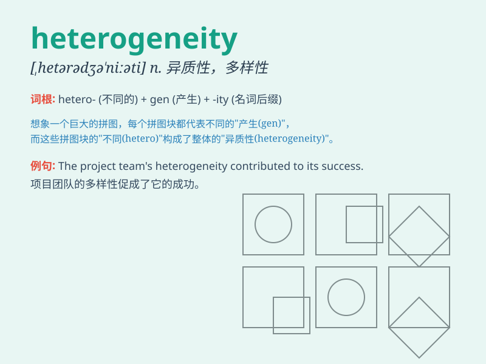

## heterogeneity

**英音:** _[ˌhɛtərəʊdʒɪˈniːɪti]_ **美音:**
_[ˌhɛtərədʒɪˈniəti]_

**译义:** *n.异种,异质,不同成分*

### 短语

+ **genetic heterogeneity:** _遗传异质性_

+ **species heterogeneity:** _物种异质性_

+ **tissue heterogeneity:** _组织异质性_

+ **environmental heterogeneity:** _环境异质性_

+ **cellular heterogeneity:** _细胞异质性_

### 例句

#### 例句1

> **The heterogeneity of the student population poses challenges for
educators.**

**中文翻译:** 学生群体的异质性给教育工作者带来了挑战。

**单词释义:** 异质性；不同种类

#### 例句2

> **The heterogeneity of the soil composition affects plant
growth.**

**中文翻译:** 土壤成分的不均一性影响植物的生长。

**单词释义:** 不均一性；多样性

#### 例句3

> **The heterogeneity in cultural backgrounds within the team
enriches the creative process.**

**中文翻译:** 团队中文化背景的差异性丰富了创作过程。

**单词释义:** 差异性

### 背诵小故事

> In a magical forest, creatures had heterogeneity. Some were tall and
some short, some had wings and some didn\'t. This variety showed the
meaning of heterogeneity - the quality of being diverse and not uniform.

**在一个神奇的森林里，生物具有异质性。有些高有些矮，有些有翅膀有些没有。这种多样性体现了heterogeneity（异质性）的含义------多样且不统一的性质。**

### 图义

