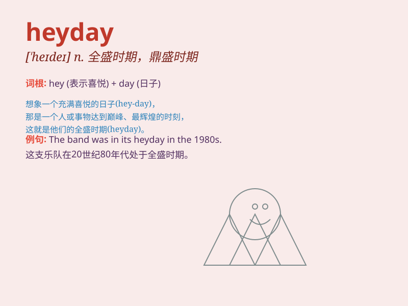

## heyday

**英音:** _[\'heɪdeɪ]_ **美音:** _[\'hede]_

**译义:** *int.喜悦、惊奇时所发声音n.全盛期,年富力强时期*

### 短语

+ **in one\'s heyday:** _在某人的鼎盛时期_

+ **the heyday of sth:** _某物的全盛时期_

+ **pass one\'s heyday:** _过了鼎盛时期_

+ **reach one\'s heyday:** _达到鼎盛时期_

+ **heyday years:** _鼎盛岁月_

### 例句

#### 例句1

> **The 1950s were the heyday of the drive-in movie theater.**

**中文翻译:** 20 世纪 50 年代是汽车影院的鼎盛时期。

**单词释义:** 鼎盛时期；全盛时期

#### 例句2

> **In its heyday, the company employed over 5,000 workers.**

**中文翻译:** 在其鼎盛时期，这家公司雇用了 5000 多名工人。

**单词释义:** 鼎盛时期；全盛时期

#### 例句3

> **The heyday of the Roman Empire was a time of great
prosperity.**

**中文翻译:** 罗马帝国的全盛时期是一个非常繁荣的时期。

**单词释义:** 全盛时期；鼎盛时期

### 背诵小故事

> 想象一下，在一个古老的小镇，有个年轻人叫
Hey。他每天都充满活力，努力工作，终于迎来了自己事业的巅峰时刻。大家都称那是
Hey 的 heyday，他的成功令人羡慕。

**想象一个叫 Hey 的年轻人迎来事业巅峰时刻，以此记住 heyday
意为鼎盛时期**

### 图义

