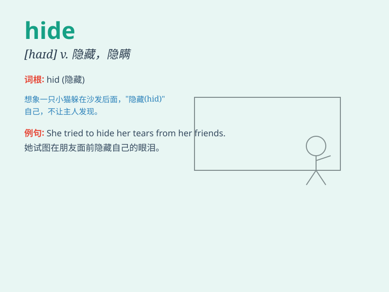

## hide

**英音:** _[haɪd]_ **美音:** _[haɪd]_

**译义:** *n.兽皮,皮革v.剥\...的皮,痛打,隐藏,掩藏,隐瞒,掩饰*

### 短语

+ **hide away:** _躲藏；隐藏_

+ **hide from:** _躲避；隐瞒_

+ **hide out:** _躲藏处；隐匿处_

+ **hide behind:** _躲在......后面_

+ **hide something from somebody:** _向某人隐瞒某事_

### 例句

#### 例句1

> **He tried to hide his disappointment.**

**中文翻译:** 他试图掩饰自己的失望。

**单词释义:** 隐藏

#### 例句2

> **The cat hid behind the sofa.**

**中文翻译:** 猫躲在沙发后面。

**单词释义:** 躲藏

#### 例句3

> **She wore a hat to hide her face.**

**中文翻译:** 她戴着一顶帽子来遮住脸。

**单词释义:** 遮住

### 背诵小故事

> A little rabbit was in danger. It needed to hide from a big bad wolf.
So it found a secret cave and stayed quiet inside. Finally, the wolf
couldn\'t find it. Hide means to keep oneself out of sight.

**一只小兔子处于危险中。它需要躲避一只大坏狼。所以它找了一个秘密洞穴，安静地待在里面。最后，狼没找到它。Hide
意思是把自己藏起来不让人看见。**

### 图义

