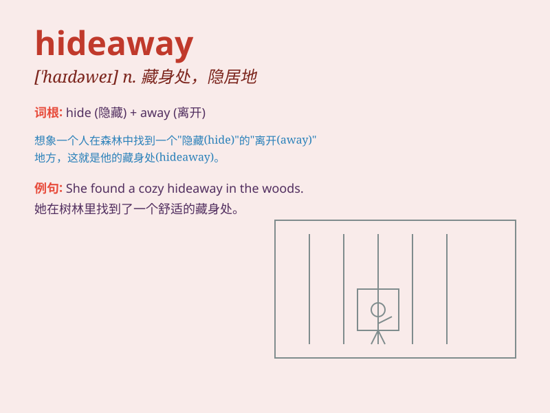

## hideaway

**英音:** _[\'haɪdəweɪ]_ **美音:** _[\'haɪdə\'we]_

**译义:** *n.隐避处*

### 短语

+ **secret hideaway:** _秘密的藏身之处_

+ **remote hideaway:** _偏远的隐匿处_

+ **peaceful hideaway:** _宁静的隐居处_

+ **luxurious hideaway:** _豪华的隐匿之所_

+ **tropical hideaway:** _热带的藏身之地_

### 例句

#### 例句1

> **They found a secluded hideaway in the mountains.**

**中文翻译:** 他们在山里找到了一处僻静的藏身之所。

**单词释义:** 隐匿处；藏身处

#### 例句2

> **The beach is a popular hideaway for couples seeking privacy.**

**中文翻译:** 对于寻求隐私的情侣来说，海滩是一个受欢迎的世外桃源。

**单词释义:** 藏身之地

#### 例句3

> **She retreated to her hideaway to escape the stress of work.**

**中文翻译:** 为了逃避工作的压力，她躲到了自己的隐秘处。

**单词释义:** 隐匿处；躲避处

### 背诵小故事

> A thief was always looking for a hideaway to escape the police. One
day, he found a secret cave and thought it was the perfect hideaway. But
eventually, the police still found him.

**一个小偷一直在寻找一个藏身之处来躲避警察。有一天，他发现了一个秘密洞穴，认为这是一个完美的隐匿之所。但最终，警察还是找到了他。**

### 图义

