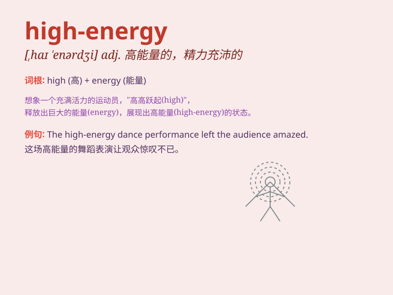

## high-energy

**英音:** _[hai-\'enerdʒi]_ **美音:** _[haɪ-\'ɛnərdʒi]_

**译义:** *形容词，高能量的；精力充沛的*

### 短语

+ **high-energy diet:** _高能量饮食_

+ **high-energy physics:** _高能物理学_

+ **high-energy particle:** _高能粒子_

+ **high-energy state:** _高能态_

+ **high-energy radiation:** _高能辐射_

### 例句

#### 例句1

> **The high-energy music got everyone on the dance floor.**

**中文翻译:** 高能量的音乐让每个人都上了舞池。

**单词释义:** 高能量的

#### 例句2

> **She prefers high-energy sports like basketball and tennis.**

**中文翻译:** 她更喜欢像篮球和网球这样的高能量运动。

**单词释义:** 高能量的

#### 例句3

> **The high-energy performance of the band thrilled the
audience.**

**中文翻译:** 乐队的高能量表演让观众兴奋不已。

**单词释义:** 高能量的

### 背诵小故事

> A group of friends went to a concert. The band on stage was amazing,
playing high-energy music. Everyone danced and jumped excitedly. The
high-energy atmosphere made the night unforgettable.

**一群朋友去了一场音乐会。舞台上的乐队棒极了，演奏着高能量的音乐。每个人都兴奋地跳舞和跳跃。这种高能量的氛围让这个夜晚难以忘怀。**

### 图义

