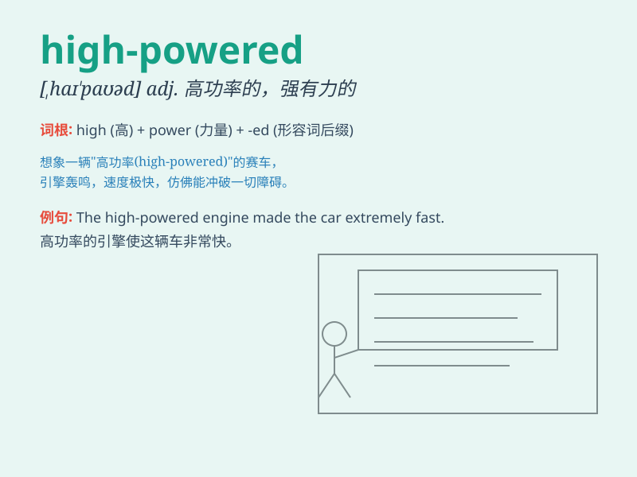

## high-powered

**英音:** _[haɪ ˈpaʊədə(r)]_ **美音:** _[haɪ ˈpaʊɚdər]_

**译义:** *形容词，强有力的；高效的；有影响力的；高水平的*

### 短语

+ **high-powered engine:** _大功率发动机_

+ **high-powered microscope:** _高倍显微镜_

+ **high-powered job:** _高强度的工作_

+ **high-powered executive:** _有强大影响力的主管_

+ **high-powered lawyer:** _能力很强的律师_

### 例句

#### 例句1

> **He drives a high-powered sports car.**

**中文翻译:** 他开着一辆高性能的跑车。

**单词释义:** 高性能的

#### 例句2

> **The high-powered microscope allowed us to see the tiny
details.**

**中文翻译:** 这台高功率的显微镜让我们能够看到微小的细节。

**单词释义:** 高功率的

#### 例句3

> **She is a high-powered executive in a large company.**

**中文翻译:** 她是一家大公司里能力很强的主管。

**单词释义:** 能力很强的

### 背诵小故事

> A high-powered car zoomed past on the highway. Its engine was so
strong that it left everyone in awe. It showed what \'high-powered\'
means - having a lot of strength or power.

**一辆高性能的汽车在高速公路上疾驰而过。它的引擎非常强大，让每个人都惊叹不已。这展示了'high-powered'的意思------有很强的力量或动力。**

### 图义

