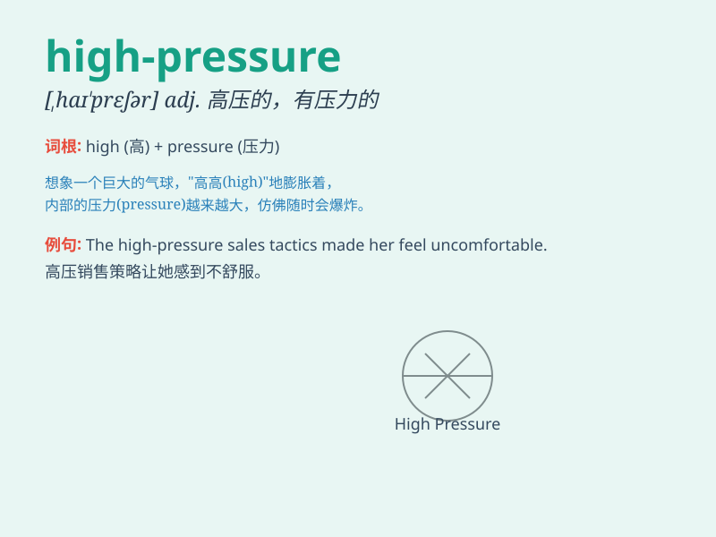

## high-pressure

**英音:** _[ˌhaɪ ˈpreʃə(r)]_ **美音:** _[ˌhaɪ ˈpreʃər]_

**译义:** *adj. 高压的；高气压的；强力的；紧张的*

### 短语

+ **high-pressure job:** _高压工作_

+ **high-pressure sales tactics:** _高压销售策略_

+ **high-pressure situation:** _高压局势_

+ **high-pressure environment:** _高压环境_

+ **high-pressure system:** _高气压系统_

### 例句

#### 例句1

> **The high-pressure job is taking a toll on his health.**

**中文翻译:** 这份高压工作正在损害他的健康。

**单词释义:** 高压的

#### 例句2

> **She can\'t handle the high-pressure sales environment.**

**中文翻译:** 她无法应对高压的销售环境。

**单词释义:** 高压的

#### 例句3

> **The high-pressure system is bringing clear skies.**

**中文翻译:** 这个高压系统带来了晴朗的天空。

**单词释义:** 高气压的

### 背诵小故事

> Once upon a time, a little bird was flying in the sky. It encountered
a high-pressure air current that made it difficult to move forward. But
with its strong will, it finally broke through. \'High-pressure\' means
a situation with great force or stress.

**从前，一只小鸟在天空中飞翔。它遇到了一股高压气流，让它难以前进。但凭借坚强的意志，它最终突破了。'high-pressure'意思是有巨大力量或压力的情况。**

### 图义

