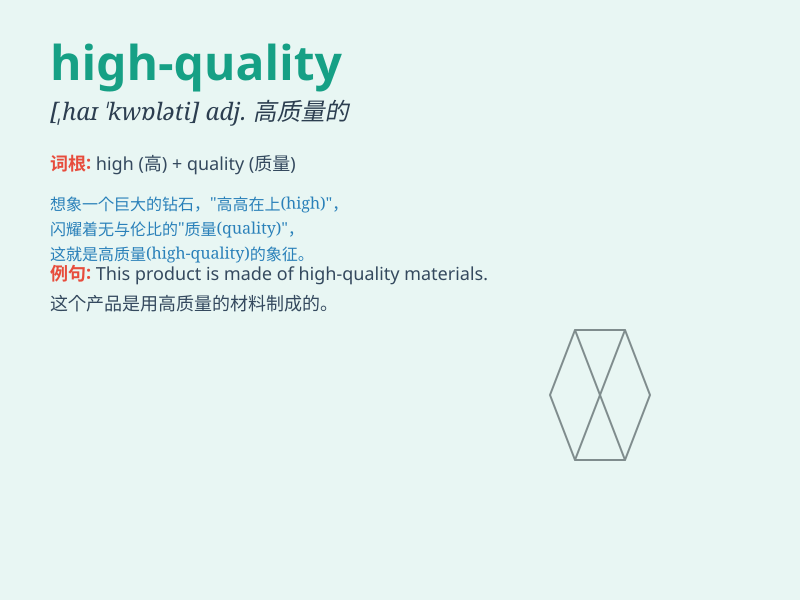

## high-quality

**英音:** _[ˌhaɪ \'kwɒləti]_ **美音:** _[ˌhaɪ
\'kwɑːləti]_

**译义:** *adj. 高质量的；优质的*

### 短语

+ **high-quality products:** _高质量的产品_

+ **high-quality service:** _高品质的服务_

+ **high-quality education:** _优质教育_

+ **high-quality materials:** _高质量的材料_

+ **high-quality performance:** _高质量的表现_

### 例句

#### 例句1

> **We offer high-quality products and services.**

**中文翻译:** 我们提供高质量的产品和服务。

**单词释义:** 高质量的

#### 例句2

> **The hotel provides high-quality accommodation.**

**中文翻译:** 这家酒店提供高品质的住宿。

**单词释义:** 高品质的

#### 例句3

> **She always buys high-quality clothes.**

**中文翻译:** 她总是买高质量的衣服。

**单词释义:** 高质量的

### 背诵小故事

> Once upon a time, a king was searching for a special gift. He finally
found a beautiful sword of high-quality. It was sharp and shiny, made
with the best materials and craftsmanship. Everyone admired its
excellence.

**从前，有个国王在寻找一份特别的礼物。他最终找到了一把高品质的漂亮宝剑。它锋利又闪亮，由最好的材料和工艺制成。每个人都称赞它的卓越品质。**

### 图义

