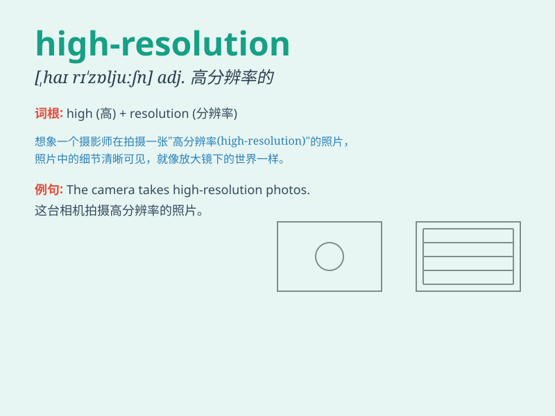

## high-resolution

**英音:** _[haɪ ˌrezəˈluːʃn]_ **美音:** _[haɪ
ˌrezəˈluːʃn]_

**译义:**
*高分辨率的，指图像、视频或其他媒体具有非常高的清晰度和细节水平。*

### 短语

+ **high-resolution image:** _高分辨率图像_

+ **high-resolution monitor:** _高分辨率显示器_

+ **high-resolution camera:** _高分辨率相机_

+ **high-resolution graphics:** _高分辨率图形_

+ **high-resolution printing:** _高分辨率打印_

### 例句

#### 例句1

> **The camera can take high-resolution photos.**

**中文翻译:** 这台相机能够拍摄高分辨率的照片。

**单词释义:** 高分辨率的

#### 例句2

> **We need a high-resolution monitor for graphic design work.**

**中文翻译:** 我们做图形设计工作需要一个高分辨率的显示器。

**单词释义:** 高分辨率的

#### 例句3

> **The satellite provides high-resolution images of the Earth\'s
surface.**

**中文翻译:** 这颗卫星提供地球表面的高分辨率图像。

**单词释义:** 高分辨率的

### 背诵小故事

> Once upon a time, a detective needed to solve a mystery. The key was
a photo, but it was blurry. Then he found a high-resolution one and saw
every tiny detail clearly. Finally, he cracked the case!

**从前，一位侦探需要解开一个谜团。关键是一张照片，但它很模糊。然后他找到了一张高分辨率的，清晰地看到了每一个微小的细节。最终，他破了案！**

### 图义

