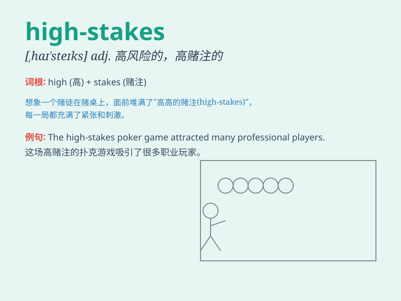

## high-stakes

**英音:** _[ˌhaɪ ˈsteɪks]_ **美音:** _[ˌhaɪ ˈsteɪks]_

**译义:** *adj.高风险的；高利害关系的*

### 短语

+ **high-stakes game:** _高风险的游戏_

+ **high-stakes test:** _高风险的测试_

+ **high-stakes decision:** _高风险的决定_

+ **high-stakes situation:** _高风险的情况_

+ **high-stakes competition:** _高风险的竞争_

### 例句

#### 例句1

> **The high-stakes poker game attracted many wealthy players.**

**中文翻译:** 这场高风险的扑克游戏吸引了许多富有的玩家。

**单词释义:** 高风险的

#### 例句2

> **She\'s involved in a high-stakes business deal that could make or
break her career.**

**中文翻译:**
她参与了一项高风险的商业交易，这可能成就或毁掉她的职业生涯。

**单词释义:** 高风险的

#### 例句3

> **The high-stakes exam determines the students\' future educational
opportunities.**

**中文翻译:** 这场高风险的考试决定了学生未来的教育机会。

**单词释义:** 高风险的

### 背诵小故事

> A gambler was in a high-stakes poker game. The prize was huge, but
the risk was equally high. He sweated, knowing one wrong move could cost
him everything. \'High-stakes\' means involving large amounts of money
or having high risks.

**一个赌徒正在参加一场高风险的扑克游戏。奖金巨大，但风险也同样高。他直冒汗，知道一个错误的举动可能会让他失去一切。"high-stakes"意思是涉及大量金钱或具有高风险。**

### 图义

