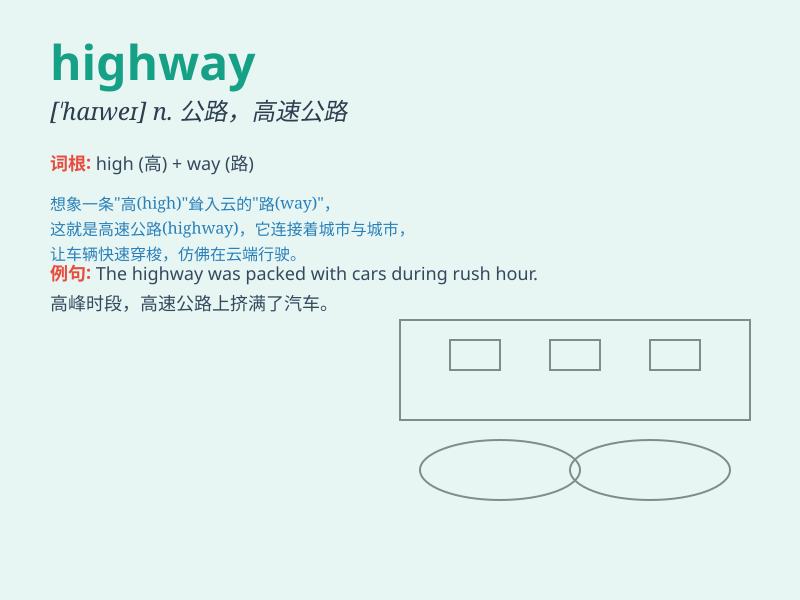

## highway

**英音:** _[\'haɪweɪ]_ **美音:** _[\'haɪwe]_

**译义:** *n.公路,大路*

### 短语

+ **national highway:** _国道_

+ **express highway:** _高速公路_

+ **information highway:** _信息高速公路_

+ **highway robbery:** _拦路抢劫_

+ **highway code:** _公路法规_

### 例句

#### 例句1

> **The car was speeding along the highway.**

**中文翻译:** 汽车在高速公路上飞驰。

**单词释义:** 高速公路

#### 例句2

> **A new highway is being built to connect the two cities.**

**中文翻译:** 一条新的高速公路正在建设中，以连接这两个城市。

**单词释义:** 高速公路

#### 例句3

> **There was a lot of traffic on the highway during the holiday.**

**中文翻译:** 假期期间，高速公路上车流量很大。

**单词释义:** 高速公路

### 背诵小故事

> One day, Tom was driving on a highway. He saw beautiful scenery along
the way. The highway was wide and smooth, allowing him to drive fast and
freely. It was a wonderful journey.

**一天，汤姆在高速公路上开车。他沿途看到了美丽的风景。高速公路又宽又平坦，让他能快速且自由地驾驶。这是一次美妙的旅程。**

### 图义

