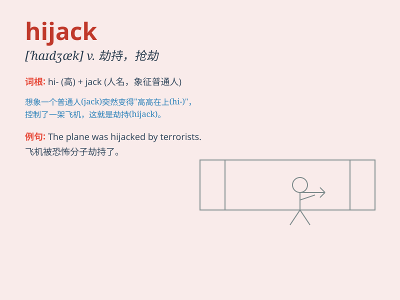

## hijack

**英音:** _[\'haɪdʒæk]_ **美音:** _[\'haɪdʒæk]_

**译义:** *vt.抢劫,劫持,劫机,揩油*

### 短语

+ **hijack a plane:** _劫持一架飞机_

+ **hijack a vehicle:** _劫持一辆车辆_

+ **hijack a shipment:** _劫持一批货物_

+ **hijack a conversation:** _打断谈话；强行控制谈话_

+ **hijack someone\'s attention:** _吸引某人的注意力_

### 例句

#### 例句1

> **The terrorists hijacked the plane and demanded a ransom.**

**中文翻译:** 恐怖分子劫持了飞机并索要赎金。

**单词释义:** 劫持

#### 例句2

> **He claimed that his idea had been hijacked by others.**

**中文翻译:** 他声称他的想法被其他人劫持了。

**单词释义:** 盗用

#### 例句3

> **The conversation was hijacked by a few loud individuals.**

**中文翻译:** 谈话被几个大声的人劫持了。

**单词释义:** 打断，强行控制

### 背诵小故事

> One day, a criminal forcefully took control of a plane during the
flight and shouted \'This plane is hijacked!\' The passengers were
terrified. Hijack means to seize control of something by force.

**有一天，一伙犯罪分子在飞行途中强行控制了一架飞机，并大喊'这架飞机被劫持了！'乘客们惊恐万分。hijack
意思是通过武力夺取某物的控制权。**

### 图义

