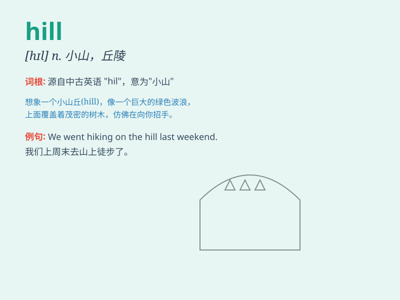

## hill

**英音:** _[hɪl]_ **美音:** _[hɪl]_

**译义:** *n.小山,丘陵,斜坡,山岗*

### 短语

+ **climb the hill:** _爬山_

+ **top of the hill:** _山顶_

+ **down the hill:** _下山_

+ **steep hill:** _陡峭的山_

+ **green hill:** _绿色的山_

### 例句

#### 例句1

> **The house is located at the top of the hill.**

**中文翻译:** 房子位于山顶。

**单词释义:** 小山；山丘

#### 例句2

> **We climbed up the steep hill.**

**中文翻译:** 我们爬上了陡峭的山坡。

**单词释义:** 小山；山丘

#### 例句3

> **The sheep were grazing on the hillside.**

**中文翻译:** 羊群正在山坡上吃草。

**单词释义:** 小山；山丘

### 背诵小故事

> One day, a little rabbit was running up a hill. It was very tired but
still kept going. When it reached the top, it saw a beautiful view. The
hill was like a big friend protecting everything around.

**一天，一只小兔子正在往山上跑。它非常累但仍在坚持。当它到达山顶时，看到了美丽的景色。这座山就像一个保护着周围一切的大朋友。**

### 图义

