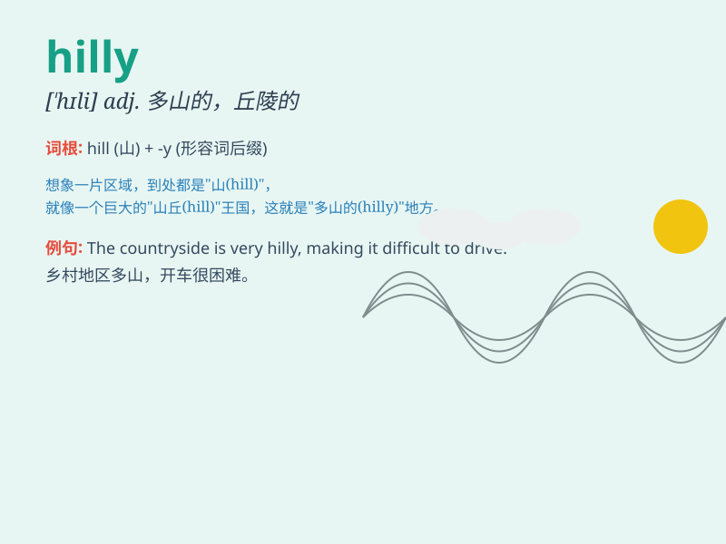

## hilly

**英音:** _[\'hɪlɪ]_ **美音:** _[\'hɪli]_

**译义:** *adj.多小山的,多坡的,陡的*

### 短语

+ **hilly area:** _丘陵地区_

+ **hilly terrain:** _丘陵地形_

+ **hilly countryside:** _多山的乡村_

+ **hilly landscape:** _丘陵景观_

+ **hilly path:** _丘陵小路_

### 例句

#### 例句1

> **The area is very hilly and not suitable for farming.**

**中文翻译:** 该地区多山，不适合耕种。

**单词释义:** 多山的

#### 例句2

> **We went for a hike in the hilly countryside.**

**中文翻译:** 我们去山区的乡村徒步旅行。

**单词释义:** 丘陵的

#### 例句3

> **The hilly terrain made the bike ride quite challenging.**

**中文翻译:** 丘陵地形使自行车骑行相当具有挑战性。

**单词释义:** 丘陵的；多小山的

### 背诵小故事

> One day, I went hiking in a place full of hills. The terrain was
hilly and it was a bit challenging. But the beautiful scenery made it
all worth it. Remember, \'hilly\' means having many hills.

**有一天，我去一个满是山丘的地方徒步旅行。地形是多山的，有点具有挑战性。但美丽的风景让一切都值得。记住，\'hilly\'意思是多山的。**

### 图义

