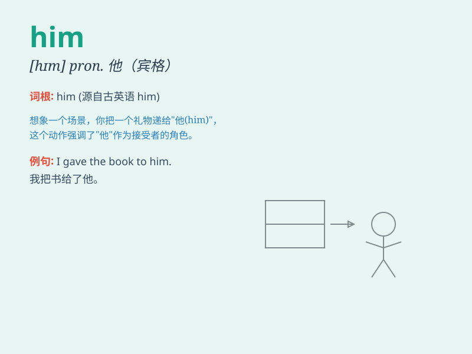

## him

**英音:** _[hɪm]_ **美音:** _[hɪm]_

**译义:** * pron.他*

### 短语

+ **leave him alone:** _别打扰他；让他一个人待着_

+ **tell him off:** _斥责他；责备他_

+ **believe in him:** _信任他；相信他_

+ **look after him:** _照顾他_

+ **depend on him:** _依靠他；依赖他_

### 例句

#### 例句1

> **I saw him at the store yesterday.**

**中文翻译:** 我昨天在商店见到他了。

**单词释义:** 他（宾格）

#### 例句2

> **Please give this book to him.**

**中文翻译:** 请把这本书给他。

**单词释义:** 他（宾格）

#### 例句3

> **I don\'t know him well.**

**中文翻译:** 我不太了解他。

**单词释义:** 他（宾格）

### 背诵小故事

> 想象一下，有个神秘的小盒子，里面藏着一张纸条，上面写着 \'Him\'
。原来是一个小男孩在捉迷藏，大家都在找他（him），最后在衣柜里找到了。

**想象一个关于
\'him\'（他）这个单词的捉迷藏故事，帮助记忆这个单词表示\'他\'的意思。**

### 图义

