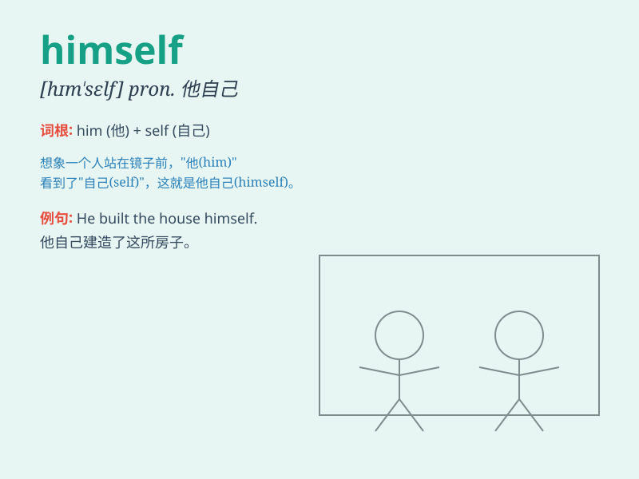

## himself

**英音:** _[hɪm\'self]_ **美音:** _[hɪm\'sɛlf]_

**译义:** * pron.他自己,他亲自*

### 短语

+ **by himself:** _独自；单独_

+ **for himself:** _为他自己_

+ **in himself:** _就他本身而言_

+ **of himself:** _自动地；自发地_

+ **to himself:** _只对他自己_

### 例句

#### 例句1

> **He hurt himself while playing football.**

**中文翻译:** 他在踢足球时受伤了。

**单词释义:** 他自己

#### 例句2

> **He himself promised to come on time.**

**中文翻译:** 他本人也答应准时来。

**单词释义:** 他自己

#### 例句3

> **He did the work all by himself.**

**中文翻译:** 他独自完成了这项工作。

**单词释义:** 他自己

### 背诵小故事

> One day, Tom was alone in the forest. He got lost but managed to find
his way back himself. It was a brave thing to do all by himself.

**一天，汤姆独自在森林里。他迷路了，但自己设法找回来了。全靠他自己做到这一切，这是一件勇敢的事。**

### 图义

