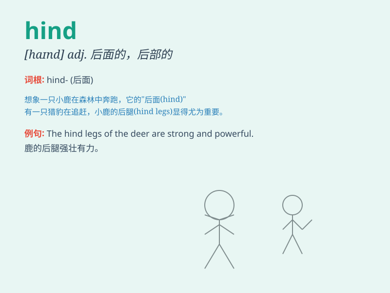

## hind

**英音:** _[haɪnd]_ **美音:** _[haɪnd]_

**译义:** *adj.后边的,后面的*

### 短语

+ **hind legs:** _后腿_

+ **hind wing:** _后翅_

+ **hind part:** _后部；后面部分_

+ **hind quarter:** _（动物的）后躯；后腿肉_

+ **the hind end:** _后端；尾部_

### 例句

#### 例句1

> **The hind legs of the horse are powerful.**

**中文翻译:** 马的后腿有力。

**单词释义:** 后面的，后部的

#### 例句2

> **The hind part of the car was damaged in the accident.**

**中文翻译:** 事故中汽车后部受损。

**单词释义:** 后面的，后部的

#### 例句3

> **The hind quarters of the dog were dirty.**

**中文翻译:** 狗的后躯很脏。

**单词释义:** 后面的，后部的

### 背诵小故事

> A hind is a female deer. Imagine a beautiful forest, and there\'s a
hind gracefully running among the trees. Her presence is so gentle and
peaceful. She\'s the symbol of beauty and tranquility in the wild.

**hind
是（雌）鹿。想象一下美丽的森林，有一只雌鹿优雅地在树木间奔跑。她的存在是如此温柔和平静。她是野外美丽与宁静的象征。**

### 图义

