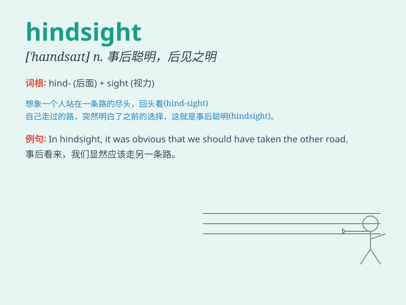

## hindsight

**英音:** _[\'haɪn(d)saɪt]_ **美音:** _[\'haɪndsaɪt]_

**译义:** *n.(火器的)照尺,后见之明,事后聪明*

### 短语

+ **in hindsight:** _事后看来；回过头来看_

+ **with hindsight:** _事后想来；事后才意识到_

+ **the benefit of hindsight:** _事后的好处；事后诸葛亮_

+ **hindsight bias:** _事后聪明偏差；事后诸葛亮偏见_

+ **hindsight wisdom:** _事后的智慧_

### 例句

#### 例句1

> **In hindsight, I should have studied harder for the exam.**

**中文翻译:** 事后看来，我应该为考试更加努力地学习。

**单词释义:** 事后的认识，事后的觉悟

#### 例句2

> **With hindsight, it was a mistake to invest in that company.**

**中文翻译:** 事后看来，投资那家公司是一个错误。

**单词释义:** 事后的认识，事后的看法

#### 例句3

> **Hindsight is always 20/20, but it doesn\'t help us at the
time.**

**中文翻译:** 事后看来总是20/20，但这对当时的我们没有帮助。

**单词释义:** 事后的清晰认识

### 背诵小故事

> A man always regretted his decisions after they failed. One day, he
realized that this was called \'hindsight\'. He vowed to make better
choices in the future.

**一个男人总是在他的决定失败后感到后悔。有一天，他意识到这就叫做"事后聪明"。他发誓未来要做出更好的选择。**

### 图义

