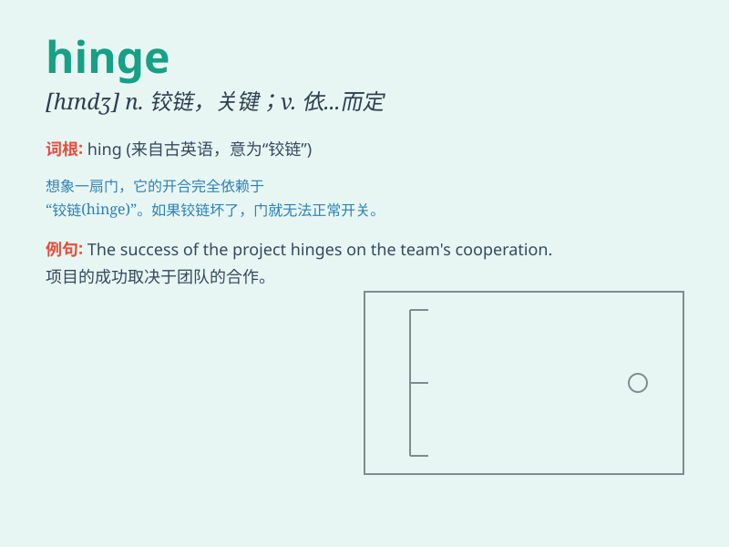

## hinge

**英音:** _[hɪn(d)ʒ]_ **美音:** _[hɪndʒ]_

**译义:**
*n.(门、盖等的)铰链,枢纽,关键vt.装铰链v.装以绞链,依\...而转移*

### 短语

+ **hinge on:** _取决于；依靠_

+ **door hinge:** _门铰链_

+ **hinge joint:** _铰链接合；枢纽关节_

+ **hinge axis:** _铰链轴_

+ **hinge plate:** _铰链板_

### 例句

#### 例句1

> **The door hinge is broken.**

**中文翻译:** 门铰链坏了。

**单词释义:** 铰链

#### 例句2

> **Everything hinges on his decision.**

**中文翻译:** 一切都取决于他的决定。

**单词释义:** 取决于

#### 例句3

> **The success of the project hinges on careful planning.**

**中文翻译:** 该项目的成功取决于周密的规划。

**单词释义:** 取决于

### 背诵小故事

> 想象一个古老的城堡大门，它的开合非常顺畅。秘密就在于那坚固的
hinge（铰链）。这个 hinge
就像一个神奇的关节，让大门能轻松地摆动。没有它，大门就无法正常工作。

**想象一个古老城堡大门的铰链，解释 hinge
这个单词，说明其像关节一样使物体能活动的作用**

### 图义

