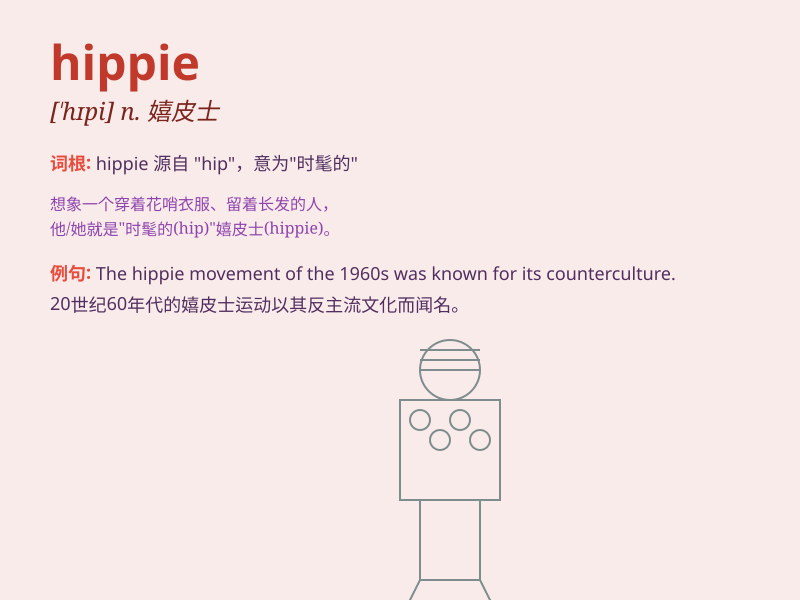

## hippie

**英音:** _[\'hɪpɪ]_ **美音:** _[\'hɪpi]_

**译义:** *n.嬉皮,嬉皮模样的年青人*

### 短语

+ **hippie culture:** _嬉皮士文化_

+ **hippie movement:** _嬉皮士运动_

+ **hippie style:** _嬉皮士风格_

+ **hippie commune:** _嬉皮士公社_

+ **hippie look:** _嬉皮士形象_

### 例句

#### 例句1

> **The hippie wore colorful clothes and had long hair.**

**中文翻译:** 嬉皮士穿着色彩鲜艳的衣服，留着长发。

**单词释义:** 嬉皮士

#### 例句2

> **In the 1960s, many young people became hippies and pursued
freedom and love.**

**中文翻译:** 20世纪60年代，许多年轻人成为嬉皮士，追求自由和爱情。

**单词释义:** 嬉皮士

#### 例句3

> **The hippie movement had a significant impact on culture and
society.**

**中文翻译:** 嬉皮士运动对文化和社会产生了重大影响。

**单词释义:** 嬉皮士

### 背诵小故事

> One day, a young man with long hair and colorful clothes was walking
in the street. People called him a hippie. He loved peace, music and
freedom. He didn\'t follow the common rules and pursued his own unique
way of life.

**有一天，一个留着长发、穿着色彩斑斓衣服的年轻人走在街上。人们称他为嬉皮士。他热爱和平、音乐和自由。他不遵循常规，追求自己独特的生活方式。**

### 图义

