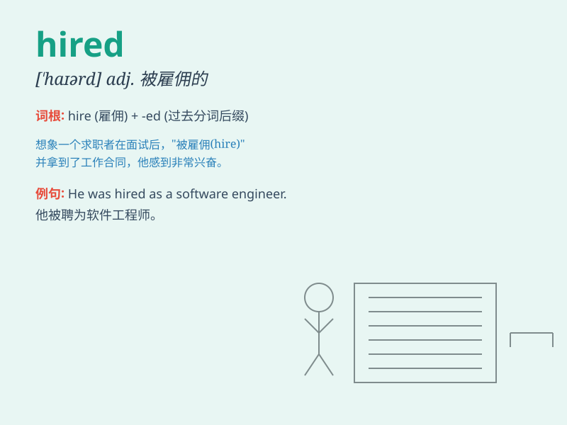

## hired

**英音:** _[ˈhʌɪəd]_ **美音:** _[ˈhaɪrd]_

**译义:** *adj. 受雇的，被雇佣的；v.
雇用（hire的过去式和过去分词形式）*

### 短语

+ **hired hand:** _雇工；受雇者_

+ **hired gun:** _受雇的枪手；受雇的专家_

+ **hired help:** _雇工；雇佣的帮手_

+ **be hired out:** _被出租；被雇出_

+ **hired car:** _租用的汽车_

### 例句

#### 例句1

> **The company hired a new marketing director last month.**

**中文翻译:** 上个月这家公司聘请了一位新的市场总监。

**单词释义:** 聘请；雇用

#### 例句2

> **We hired a car for the weekend.**

**中文翻译:** 我们周末租了一辆车。

**单词释义:** 租用

#### 例句3

> **She was hired to do the cleaning.**

**中文翻译:** 她被雇来做清洁工作。

**单词释义:** 雇用

### 背诵小故事

> A young man was very hardworking. One day, he was HIRED by a big
company. He was so excited because his efforts were finally recognized.
From then on, he worked even harder in his new job.

**一个年轻人非常勤奋。有一天，他被一家大公司雇用了。他非常兴奋，因为他的努力终于得到了认可。从那以后，他在新工作中更加努力了。**

### 图义

