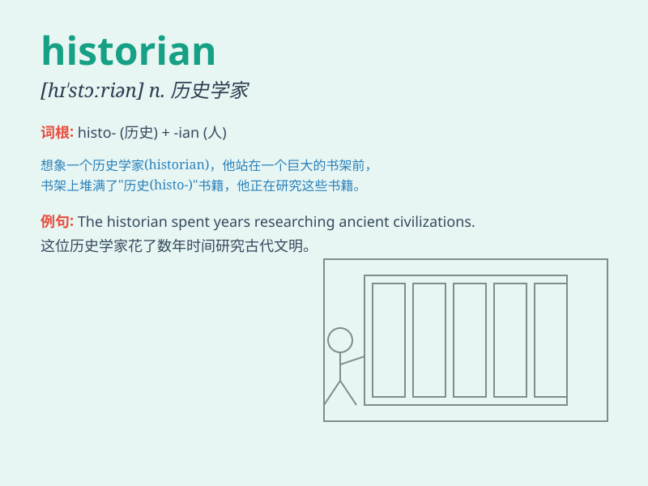

## historian

**英音:** _[hɪ\'stɔːrɪən]_ **美音:** _[hɪ\'stɔrɪən]_

**译义:** *n.历史学家,史家*

### 短语

+ **military historian:** _军事史学家_

+ **social historian:** _社会史学家_

+ **cultural historian:** _文化史学家_

+ **economic historian:** _经济史学家_

+ **historian of science:** _科学史学家_

### 例句

#### 例句1

> **The historian spent years researching ancient civilizations.**

**中文翻译:** 这位历史学家花了数年时间研究古代文明。

**单词释义:** 历史学家

#### 例句2

> **She is a renowned historian specializing in medieval history.**

**中文翻译:** 她是一位著名的历史学家，专门研究中世纪历史。

**单词释义:** 历史学家

#### 例句3

> **The historian\'s work shed new light on the events of that
era.**

**中文翻译:** 这位历史学家的著作为那个时代的事件提供了新的线索。

**单词释义:** 历史学家

### 背诵小故事

> A historian was like a time traveler. He/she journeyed through the
past, collecting stories and facts. One historian found an old diary
that revealed secrets of a forgotten kingdom. With each discovery, they
painted a vivid picture of history.

**一位历史学家就像一位时间旅行者。他/她穿梭于过去，收集故事和事实。有一位历史学家发现了一本旧日记，揭示了一个被遗忘王国的秘密。每一次发现，他们都描绘出一幅生动的历史画卷。**

### 图义

