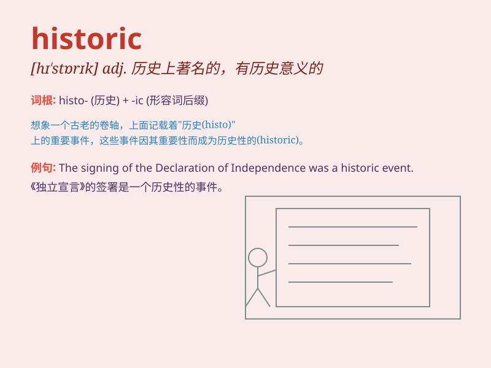

## historic

**英音:** _[hɪ\'stɒrɪk]_ **美音:** _[hɪ\'stɔrɪk]_

**译义:** *adj.历史上著名的,有历史性的*

### 短语

+ **historic event:** _历史性事件_

+ **historic site:** _历史遗迹_

+ **historic moment:** _历史性时刻_

+ **historic building:** _历史建筑_

+ **historic district:** _历史街区_

### 例句

#### 例句1

> **The historic building has witnessed many significant events.**

**中文翻译:** 这座历史建筑见证了许多重大事件。

**单词释义:** 具有历史意义的

#### 例句2

> **This is a historic moment for our country.**

**中文翻译:** 对于我们国家来说，这是一个历史性时刻。

**单词释义:** 历史性的

#### 例句3

> **The discovery was of historic importance.**

**中文翻译:** 这一发现具有重要的历史意义。

**单词释义:** 历史（上）重要的

### 背诵小故事

> A time traveler journeyed to a historic era. There, he witnessed
grand palaces and ancient battles. This experience made him understand
the importance of preserving the past. \'Historic\' means having
importance in history.

**一位时间旅行者去到了一个历史上重要的时代。在那里，他目睹了宏伟的宫殿和古老的战役。这次经历让他明白了保存过去的重要性。'historic'意思是在历史上有重要意义的。**

### 图义

