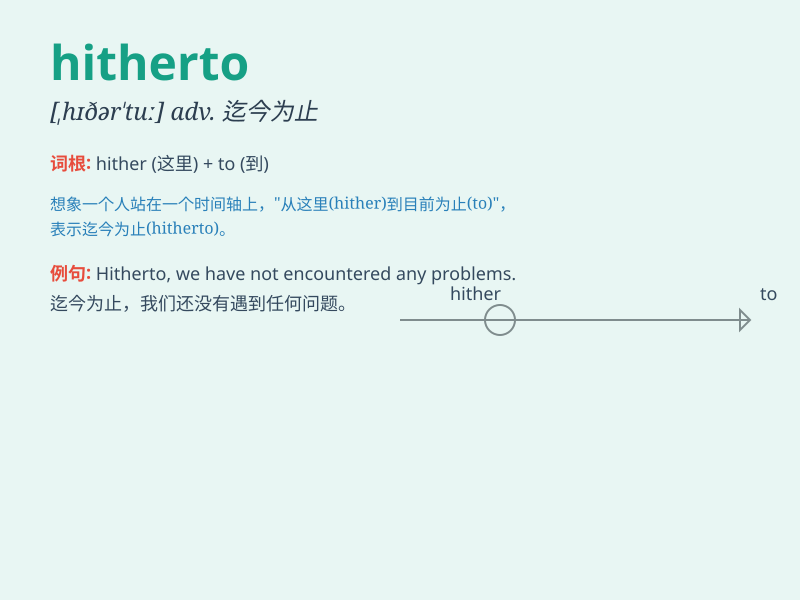

## hitherto

**英音:** _[hɪðə\'tuː; \'hɪðətuː]_ **美音:**
_[,hɪðɚ\'tu]_

**译义:** *adv.迄今,至今*

### 短语

+ **hitherto unknown:** _迄今未知_

+ **hitherto unheard-of:** _前所未闻的_

+ **hitherto undiscovered:** _迄今未被发现的_

+ **hitherto unseen:** _迄今未见的_

+ **hitherto unimagined:** _迄今难以想象的_

### 例句

#### 例句1

> **Hitherto, she has never failed an exam.**

**中文翻译:** 到目前为止，她从来没有考试不及格过。

**单词释义:** 到目前为止；迄今

#### 例句2

> **Hitherto, we have solved many difficult problems.**

**中文翻译:** 迄今，我们已经解决了许多难题。

**单词释义:** 迄今

#### 例句3

> **The project has hitherto proved very successful.**

**中文翻译:** 该项目到目前为止已被证明非常成功。

**单词释义:** 到目前为止

### 背诵小故事

> A brave adventurer set out on a journey. Hitherto, he had faced many
challenges but never gave up. One day, he finally reached the
destination he had dreamed of. \'Hitherto\' means up to this time or
until now.

**一位勇敢的冒险家踏上了旅程。迄今为止，他面临了许多挑战但从未放弃。有一天，他终于到达了梦想中的目的地。'hitherto'意思是到目前为止，直到现在。**

### 图义

