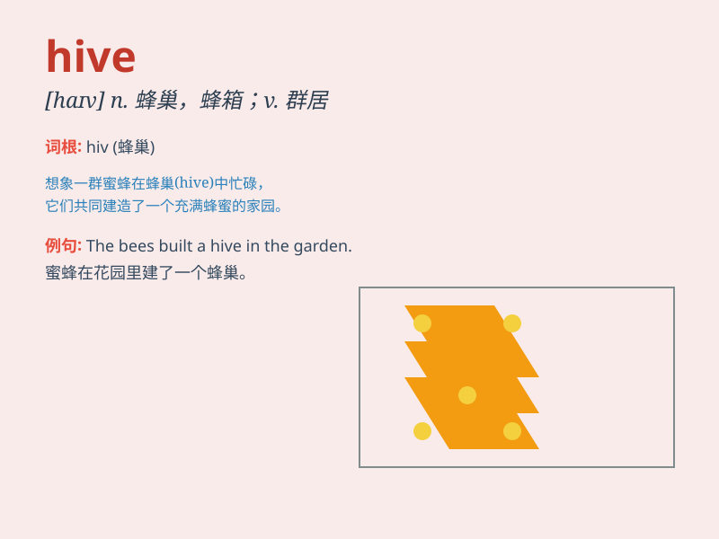

## hive

**英音:** _[haɪv]_ **美音:** _[haɪv]_

**译义:** *n.蜂房,蜂箱,闹市v.(使)入蜂箱,群居*

### 短语

+ **bee hive:** _蜂箱_

+ **hive mind:** _集体思维；群体意识_

+ **hive off:** _（从大机构中）分离出来，拆分_

+ **hive away:** _贮藏；囤积_

+ **hive something up:** _储藏；积攒_

### 例句

#### 例句1

> **The bees are busy in the hive.**

**中文翻译:** 蜜蜂在蜂巢里忙碌着。

**单词释义:** 蜂巢

#### 例句2

> **She works in a data hive.**

**中文翻译:** 她在一个数据中心工作。

**单词释义:** 中心；集中地

#### 例句3

> **The children were playing in the sand hive.**

**中文翻译:** 孩子们在沙坑中玩耍。

**单词释义:** 坑；巢

### 背诵小故事

> In a beautiful garden, there was a hive full of busy bees. The bees
flew in and out, working hard to make honey. The hive was like a small
factory where the bees lived and worked together.

**在一个美丽的花园里，有一个满是忙碌蜜蜂的蜂箱。蜜蜂们飞进飞出，努力地酿造蜂蜜。这个蜂箱就像一个小工厂，蜜蜂们在这里一起生活和工作。**

### 图义

