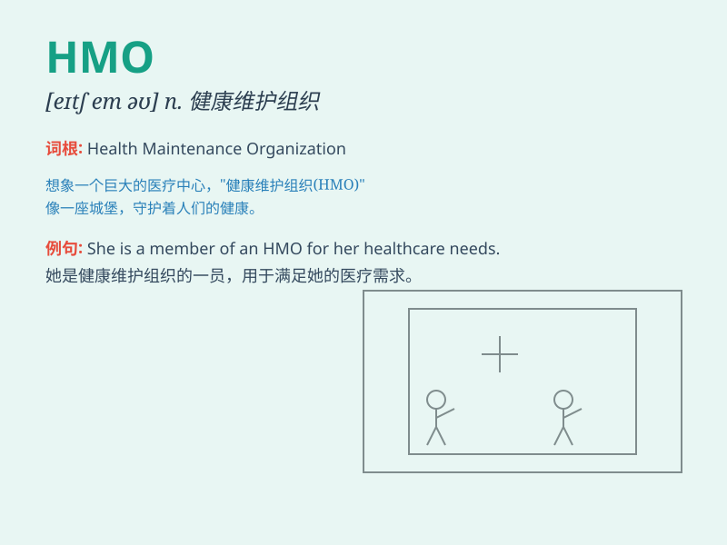

## HMO

**英音:** __ **美音:** __

**译义:** *abbr. 健康维护组织（Health Maintenance Organization）*

### 短语

+ **HMO plan:** _健康维护组织计划_

+ **HMO provider:** _健康维护组织提供者_

+ **HMO coverage:** _健康维护组织保险范围_

+ **HMO network:** _健康维护组织网络_

+ **HMO member:** _健康维护组织成员_

### 例句

#### 例句1

> **I chose an HMO for my health insurance because it was more
affordable.**

**中文翻译:**
我选择了健康维护组织（HMO）作为我的健康保险，因为它更实惠。

**单词释义:** 健康维护组织

#### 例句2

> **The HMO provides a wide range of medical services to its
members.**

**中文翻译:** 这个健康维护组织为其成员提供了广泛的医疗服务。

**单词释义:** 健康维护组织

#### 例句3

> **Some people prefer traditional insurance over an HMO.**

**中文翻译:** 有些人喜欢传统保险胜过健康维护组织。

**单词释义:** 健康维护组织

### 背诵小故事

> 想象一下，有个神奇的健康组织叫
HMO，它就像一个超级医生团队，能为大家提供全面且经济的医疗服务。成员们都很信任它，因为它总是能照顾好大家的健康。

**想象一个关于
HMO（健康维护组织）的故事，它是一个提供医疗服务的组织，成员信任它能保障健康。**

### 图义

