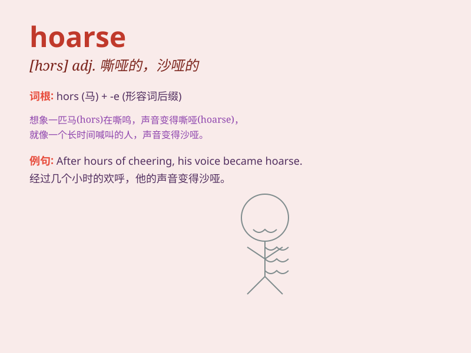

## hoarse

**英音:** _[hɔːs]_ **美音:** _[hɔrs]_

**译义:** *adj.嘶哑的*

### 短语

+ **hoarse voice:** _嘶哑的嗓音_

+ **become hoarse:** _变得嘶哑_

+ **hoarse cry:** _沙哑的哭声_

+ **speak in a hoarse tone:** _用嘶哑的声调说话_

+ **hoarse from shouting:** _因喊叫而声音嘶哑_

### 例句

#### 例句1

> **He has a hoarse voice because of the cold.**

**中文翻译:** 他因为感冒声音变得沙哑。

**单词释义:** 沙哑的

#### 例句2

> **After shouting for hours, her voice became hoarse.**

**中文翻译:** 喊了几个小时后，她的声音变得沙哑了。

**单词释义:** 沙哑的

#### 例句3

> **The singer\'s hoarse singing added a unique charm to the
song.**

**中文翻译:** 这位歌手沙哑的歌声为这首歌增添了独特的魅力。

**单词释义:** 沙哑的

### 背诵小故事

> A singer sang loudly for hours at a concert. The next day, her voice
became hoarse. She could hardly speak. Poor singer! Now you know
\'hoarse\' means having a rough and harsh voice.

**一位歌手在演唱会上大声唱了好几个小时。第二天，她的声音变得嘶哑。她几乎说不出话来。可怜的歌手！现在你知道'hoarse'是指声音粗哑的。**

### 图义

