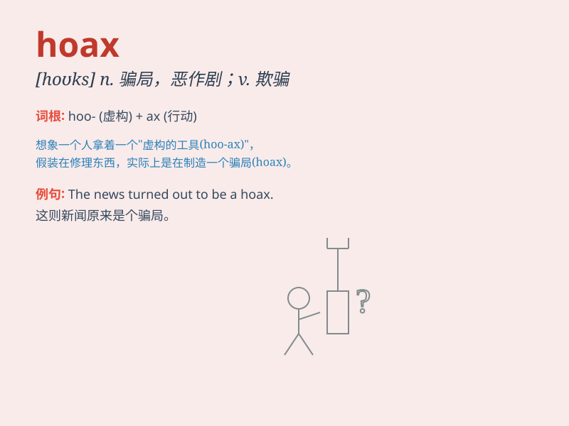

## hoax

**英音:** _[həʊks]_ **美音:** _[hoks]_

**译义:** *v.愚弄n.愚弄*

### 短语

+ **hoax call:** _恶作剧电话_

+ **hoax email:** _诈骗电子邮件_

+ **hoax story:** _骗局故事_

+ **perpetrate a hoax:** _进行一场骗局_

+ **fall victim to a hoax:** _成为骗局的受害者_

### 例句

#### 例句1

> **The email was a hoax and contained no real information.**

**中文翻译:** 这封电子邮件是个骗局，没有包含任何真实信息。

**单词释义:** 骗局

#### 例句2

> **They exposed the hoax and saved many people from being
deceived.**

**中文翻译:** 他们揭露了这个骗局，使许多人免于受骗。

**单词释义:** 骗局；恶作剧

#### 例句3

> **The story about the monster turned out to be a hoax.**

**中文翻译:** 关于那个怪物的故事结果是个骗局。

**单词释义:** 骗局；愚弄

### 背诵小故事

> One day, Tom received a message saying he won a big prize. But it
turned out to be a hoax. He was very disappointed. Remember, a hoax is a
deception or fraud.

**一天，汤姆收到一条消息说他中了大奖。但结果这是个骗局。他非常失望。记住，hoax
就是欺骗或欺诈。**

### 图义

