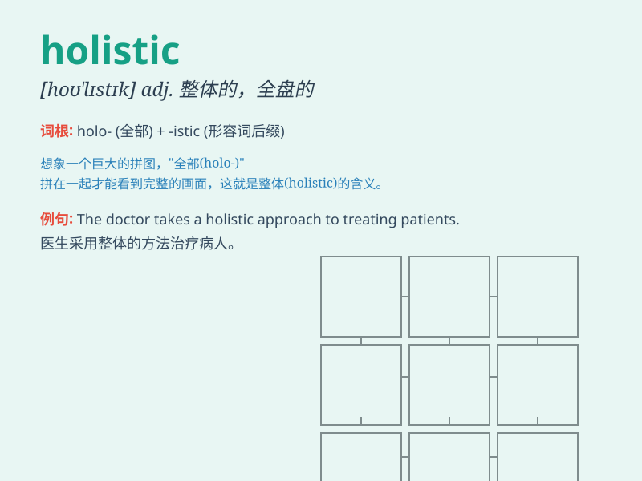

## holistic

**英音:** _[həʊ\'lɪstɪk; hɒ-]_ **美音:** _[ho\'lɪstɪk]_

**译义:** *adj.整体的,全盘的*

### 短语

+ **holistic approach:** _整体方法；全面的方法_

+ **holistic medicine:** _整体医学；综合医学_

+ **holistic view:** _整体观点；全面看法_

+ **holistic education:** _整体教育；全人教育_

+ **holistic therapy:** _整体疗法；综合疗法_

### 例句

#### 例句1

> **We need to take a holistic approach to solve this complex
problem.**

**中文翻译:** 我们需要采取整体方法来解决这个复杂的问题。

**单词释义:** 整体的；全面的

#### 例句2

> **The doctor provided a holistic treatment plan for the
patient.**

**中文翻译:** 医生为患者提供了整体治疗方案。

**单词释义:** 全面的；整体的

#### 例句3

> **Holistic education focuses on the development of the whole
person.**

**中文翻译:** 全人教育注重人的全面发展。

**单词释义:** 整体的；全面的

### 背诵小故事

> A doctor was known for his holistic approach. He didn\'t just treat
symptoms but considered a patient\'s entire life, like diet and stress.
This way, he provided comprehensive care and achieved better results.

**一位医生以其整体治疗方法而闻名。他不仅仅治疗症状，还考虑患者的整个生活，如饮食和压力。通过这种方式，他提供了全面的护理并取得了更好的效果。**

### 图义

