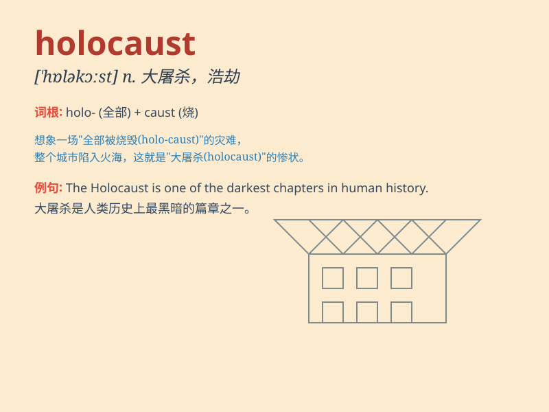

## holocaust

**英音:** _[\'hɒləkɔːst]_ **美音:** _[\'hɑləkɔst]_

**译义:** *n.大毁灭,大屠杀*

### 短语

+ **nuclear holocaust:** _核大屠杀_

+ **the Holocaust:** _（尤指二战期间纳粹对犹太人的）大屠杀_

+ **Holocaust survivor:** _大屠杀幸存者_

+ **Holocaust Memorial Day:** _大屠杀纪念日_

+ **Holocaust literature:** _大屠杀文学_

### 例句

#### 例句1

> **The holocaust was one of the most tragic events in human
history.**

**中文翻译:** 大屠杀是人类历史上最悲惨的事件之一。

**单词释义:** 大屠杀；大灾难

#### 例句2

> **The survivors of the holocaust have shared their harrowing
experiences.**

**中文翻译:** 大屠杀的幸存者分享了他们的悲惨经历。

**单词释义:** 大屠杀；大灾难

#### 例句3

> **We must ensure that such a holocaust never happens again.**

**中文翻译:** 我们必须确保这样的大屠杀不再发生。

**单词释义:** 大屠杀；大灾难

### 背诵小故事

> In a distant land, a huge fire broke out, destroying everything in
its path. People called this disaster a \'holocaust\'. It was a
terrifying scene of total destruction and great loss.

**在一片遥远的土地上，一场巨大的火灾爆发了，摧毁了沿途的一切。人们称这场灾难为"大屠杀；大灾难"。这是一幅彻底毁灭和巨大损失的可怕景象。**

### 图义

