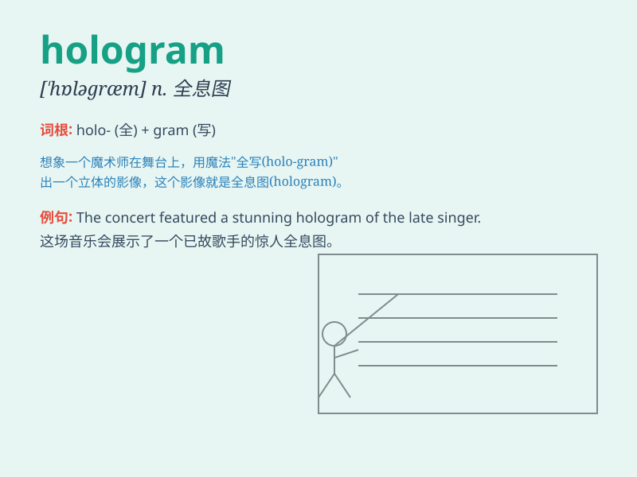

## hologram

**英音:** _[\'hɒləgræm]_ **美音:** _[hɑləˌɡræm]_

**译义:** * 全息摄影,全息图*

### 短语

+ **hologram technology:** _全息技术_

+ **three-dimensional hologram:** _三维全息图_

+ **hologram display:** _全息显示_

+ **optical hologram:** _光学全息图_

+ **hologram projector:** _全息投影仪_

### 例句

#### 例句1

> **The museum displayed a stunning hologram of a dinosaur.**

**中文翻译:** 博物馆展示了令人惊叹的恐龙全息图。

**单词释义:** 全息图

#### 例句2

> **The singer appeared as a hologram during the concert.**

**中文翻译:** 这位歌手在音乐会期间以全息图的形式出现。

**单词释义:** 全息影像

#### 例句3

> **The new technology allows for more realistic holograms.**

**中文翻译:** 新技术可以实现更真实的全息图。

**单词释义:** 全息图

### 背诵小故事

> One day, Tom was at a science exhibition. He saw a strange object and
was told it was a hologram. It looked so real, like a 3D image floating
in the air. Tom was amazed by this magical hologram.

**有一天，汤姆在一个科学展览上。他看到一个奇怪的物体，被告知这是一个全息图。它看起来如此逼真，就像一个在空中漂浮的
3D 图像。汤姆对这个神奇的全息图感到十分惊讶。**

### 图义

