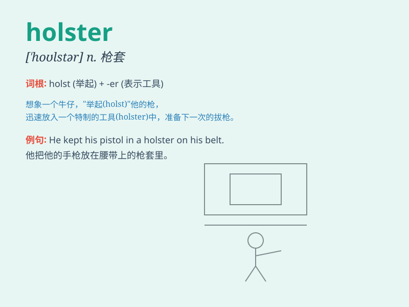

## holster

**英音:** _[\'həʊlstə; \'hɒl-]_ **美音:** _[\'holstɚ]_

**译义:** *n.手枪用的皮套*

### 短语

+ **gun holster:** _枪套_

+ **hip holster:** _臀侧枪套_

+ **shoulder holster:** _肩挂式枪套_

+ **leather holster:** _皮制枪套_

+ **holster belt:** _枪套腰带_

### 例句

#### 例句1

> **The police officer drew his gun from the holster quickly.**

**中文翻译:** 警察迅速从枪套里抽出了枪。

**单词释义:** 枪套

#### 例句2

> **He fastened the holster to his belt before leaving the house.**

**中文翻译:** 离开家之前，他把皮套系在腰带上。

**单词释义:** 枪套

#### 例句3

> **The cowboy\'s holster was beautifully decorated.**

**中文翻译:** 牛仔的皮套装饰得很漂亮。

**单词释义:** 枪套

### 背诵小故事

> A brave cowboy was in a dangerous situation. Just in time, he quickly
drew his gun from the holster on his belt and aimed it at the enemy. The
holster protected the gun and made it easy to access when needed.

**一位勇敢的牛仔身处险境。关键时刻，他迅速从腰带上的枪套（holster）里拔出枪，瞄准敌人。枪套保护着枪，并在需要时能让他轻松取用。**

### 图义

