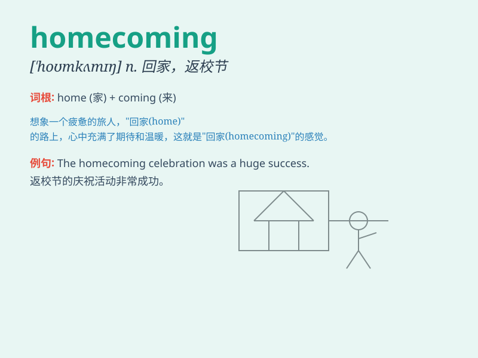

## homecoming

**英音:** _[\'həʊmkʌmɪŋ]_ **美音:** _[\'homkʌmɪŋ]_

**译义:** *n.回老家,回国*

### 短语

+ **homecoming dance:** _返校舞会_

+ **homecoming game:** _返校比赛_

+ **homecoming party:** _返校聚会_

+ **homecoming queen:** _返校节女王_

+ **homecoming weekend:** _返校周末_

### 例句

#### 例句1

> **The homecoming of the soldiers was a joyous occasion for the
town.**

**中文翻译:** 士兵们的归来给全镇带来了欢乐的时刻。

**单词释义:** 归来；回国；回家

#### 例句2

> **She was excited about her homecoming after a long trip
abroad.**

**中文翻译:** 经过长途旅行后回国，她感到很兴奋。

**单词释义:** 回国；回家

#### 例句3

> **The school\'s homecoming game attracted a large crowd.**

**中文翻译:** 学校的返校节比赛吸引了大批观众。

**单词释义:** 校友返校

### 背诵小故事

> A student had been away at school for a long time. When the vacation
came, it was the homecoming. He was so excited to see his family and his
familiar room. Finally, he was back home.

**一个学生在学校待了很长时间。当假期来临，就是他的归家之时。他非常兴奋能见到家人和熟悉的房间。最终，他回家了。**

### 图义

