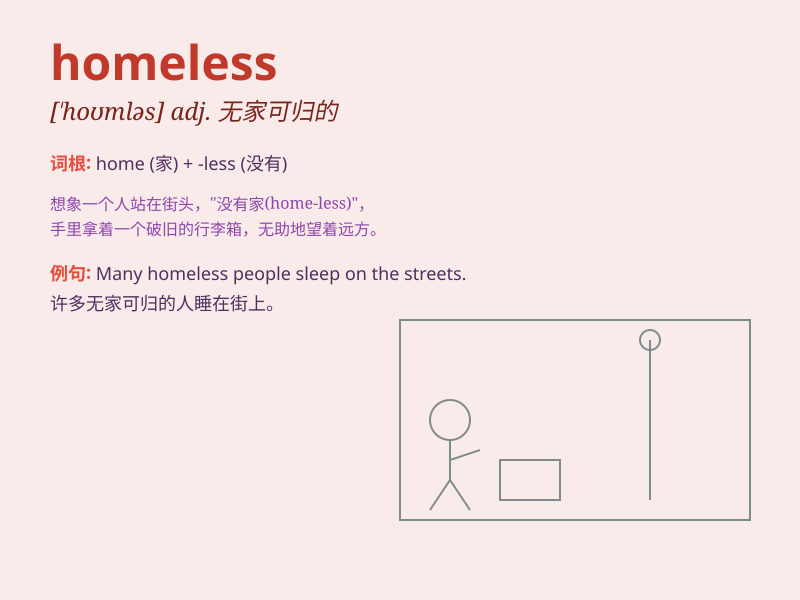

## homeless

**英音:** _[\'həʊmlɪs]_ **美音:** _[\'homləs]_

**译义:** *adj.无家的,无家可归的*

### 短语

+ **the homeless:** _无家可归者（指这一群体）_

+ **become homeless:** _变得无家可归_

+ **homeless people:** _无家可归的人_

+ **homeless shelter:** _无家可归者收容所_

+ **homeless problem:** _无家可归问题_

### 例句

#### 例句1

> **The city has many homeless people living on the streets.**

**中文翻译:** 这个城市有许多无家可归的人流落街头。

**单词释义:** 无家可归的

#### 例句2

> **We should show compassion to the homeless and try to help
them.**

**中文翻译:** 我们应该对无家可归者表示同情并尽力帮助他们。

**单词释义:** 无家可归的

#### 例句3

> **The homeless shelter provides food and accommodation for those in
need.**

**中文翻译:** 无家可归者收容所为有需要的人提供食物和住宿。

**单词释义:** 无家可归的

### 背诵小故事

> One cold night, Tom saw a man sleeping on the street. The man had no
home and was homeless. Tom felt sad and decided to help. He understood
that homeless people needed care and a place to belong.

**在一个寒冷的夜晚，汤姆看到一个男人睡在街上。这个男人没有家，是无家可归的。汤姆感到难过并决定帮忙。他明白无家可归的人需要关怀和一个归属之地。**

### 图义

