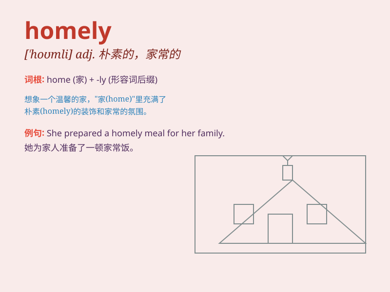

## homely

**英音:** _[\'həʊmlɪ]_ **美音:** _[\'homli]_

**译义:** *adj.家常的*

### 短语

+ **homely atmosphere:** _温馨的氛围_

+ **homely meal:** _家常便饭_

+ **homely woman:** _相貌平平的女人_

+ **homely furniture:** _朴素的家具_

+ **homely comfort:** _家庭般的舒适_

### 例句

#### 例句1

> **The cottage had a homely feel to it.**

**中文翻译:** 小屋有一种宾至如归的感觉。

**单词释义:** 舒适的，亲切的

#### 例句2

> **She has a homely face but a kind heart.**

**中文翻译:** 她有一张相貌平平的面孔，却有一颗善良的心。

**单词释义:** 相貌平平的

#### 例句3

> **The hotel provided a homely atmosphere and good service.**

**中文翻译:** 酒店提供温馨的氛围和优质的服务。

**单词释义:** 像家一样的，温馨的

### 背诵小故事

> A girl named Lily always felt sad because people called her homely.
But one day, a kind friend told her that homely means having a simple
and comfortable charm like home. Lily then understood it wasn\'t an
insult and became confident.

**一个叫莉莉的女孩总是很伤心，因为人们说她homely。但有一天，一个善良的朋友告诉她，homely意味着有着像家一样简单舒适的魅力。莉莉这才明白这不是侮辱，变得自信起来。**

### 图义

