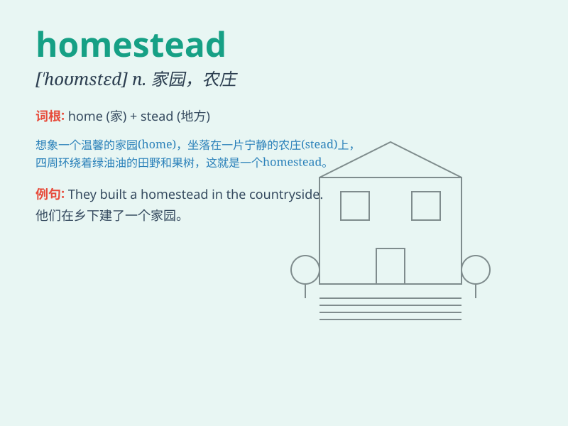

## homestead

**英音:** _[\'həʊmsted]_ **美音:** _[\'homstɛd]_

**译义:** *n.家园,田产*

### 短语

+ **homestead act:** _宅地法_

+ **homestead exemption:** _宅地免税_

+ **homestead farm:** _自耕农场_

+ **homestead land:** _宅地_

+ **claim a homestead:** _要求获得宅地_

### 例句

#### 例句1

> **They moved to a remote homestead to start a new life.**

**中文翻译:** 他们搬到了偏僻的宅基地，开始了新的生活。

**单词释义:** 家园；宅地

#### 例句2

> **The old homestead was passed down through generations.**

**中文翻译:** 老宅基地是代代相传的。

**单词释义:** 宅地；家宅

#### 例句3

> **She spent her childhood on the family homestead.**

**中文翻译:** 她的童年是在自家宅基地度过的。

**单词释义:** 家庭农场；家宅

### 背诵小故事

> A young couple decided to leave the city and build their homestead in
the countryside. They worked hard, planted crops, and raised animals.
Their homestead became a peaceful and happy place.

**一对年轻夫妇决定离开城市，在乡下建立他们的家园。他们努力劳作，种植庄稼，饲养动物。他们的家园变成了一个宁静快乐的地方。**

### 图义

