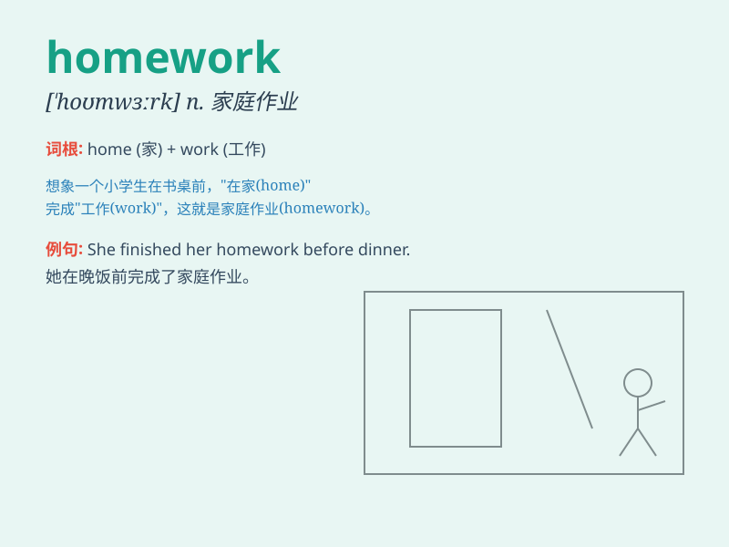

## homework

**英音:** _[\'həʊmwɜːk]_ **美音:** _[\'hom\'wɝk]_

**译义:** *n.家庭作业,副业*

### 短语

+ **do homework:** _做作业_

+ **finish homework:** _完成作业_

+ **hand in homework:** _交作业_

+ **check homework:** _检查作业_

+ **too much homework:** _太多作业_

### 例句

#### 例句1

> **I have a lot of homework to do tonight.**

**中文翻译:** 今晚我有很多作业要做。

**单词释义:** 作业

#### 例句2

> **The teacher assigned difficult homework for the weekend.**

**中文翻译:** 老师周末布置了困难的作业。

**单词释义:** 作业

#### 例句3

> **He finished his homework before dinner.**

**中文翻译:** 他在晚饭前完成了作业。

**单词释义:** 作业

### 背诵小故事

> One day, Tom was playing outside. But when he remembered the homework
his teacher assigned, he rushed home. He spent hours at his desk,
working hard to finish it. Finally, he completed the homework and felt
relieved.

**有一天，汤姆正在外面玩。但当他想起老师布置的家庭作业时，他急忙跑回家。他在书桌前花了几个小时，努力完成作业。最后，他完成了作业，感到如释重负。**

### 图义

