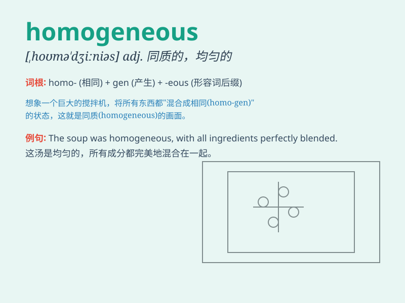

## homogeneous

**英音:** _[,hɒmə(ʊ)\'dʒiːnɪəs; -\'dʒen-]_ **美音:**
_[,homə\'dʒinɪəs]_

**译义:** *adj.同类的,相似的,均一的,均匀的*

### 短语

+ **homogeneous mixture:** _均匀混合物_

+ **homogeneous function:** _齐次函数_

+ **homogeneous equation:** _齐次方程_

+ **homogeneous population:** _同质群体_

+ **homogeneous material:** _均质材料_

### 例句

#### 例句1

> **The population of this city is relatively homogeneous in terms of
ethnicity.**

**中文翻译:** 这个城市的人口在种族方面相对同质。

**单词释义:** 同质的；相似的

#### 例句2

> **The team is homogeneous in terms of skills and experience.**

**中文翻译:** 该团队在技能和经验方面是同质的。

**单词释义:** 相似的；同类的

#### 例句3

> **This material is homogeneous throughout its structure.**

**中文翻译:** 这种材料的整个结构是均匀的。

**单词释义:** 均匀的；均质的

### 背诵小故事

>
想象一个魔法工厂，里面生产的所有糖果看起来、尝起来都一模一样。这个工厂就像\'homogeneous\'，意味着同质的、均匀的。没有任何一颗糖果与众不同，它们的品质和特征完全相同。

**想象一个生产完全相同糖果的魔法工厂来辅助理解\'homogeneous\'意为同质的、均匀的**

### 图义

