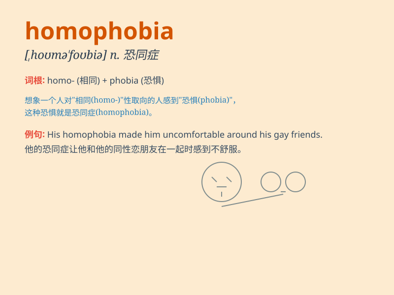

## homophobia

**英音:** _[ˌhəʊməˈfəʊbiə]_ **美音:** _[ˌhoʊməˈfoʊbiə]_

**译义:** *n.对同性恋者的憎恶（或恐惧）*

### 短语

+ **homophobia discrimination:** _恐同歧视_

+ **combat homophobia:** _对抗恐同_

+ **root out homophobia:** _根除恐同_

+ **reduce homophobia:** _减少恐同_

+ **awareness of homophobia:** _对恐同的认识_

### 例句

#### 例句1

> **We must fight against homophobia to create an inclusive
society.**

**中文翻译:** 我们必须与恐同现象作斗争，以创建一个包容的社会。

**单词释义:** 对同性恋者的恐惧和厌恶

#### 例句2

> **His speech was aimed at raising awareness of homophobia in the
workplace.**

**中文翻译:** 他的演讲旨在提高人们对工作场所中恐同现象的认识。

**单词释义:** 对同性恋的恐惧和反感

#### 例句3

> **The campaign against homophobia has gained significant momentum
in recent years.**

**中文翻译:** 近年来，反对恐同的运动势头强劲。

**单词释义:** 对同性恋者的憎恶和偏见

### 背诵小故事

> Once upon a time, in a small town, a man named Tom showed strong
dislike and fear when he saw two men holding hands. This kind of unjust
attitude and fear was called homophobia.

**从前，在一个小镇上，一个叫汤姆的男人看到两个男人手牵手时表现出强烈的不喜欢和恐惧。这种不公正的态度和恐惧就被称为恐同。**

### 图义

