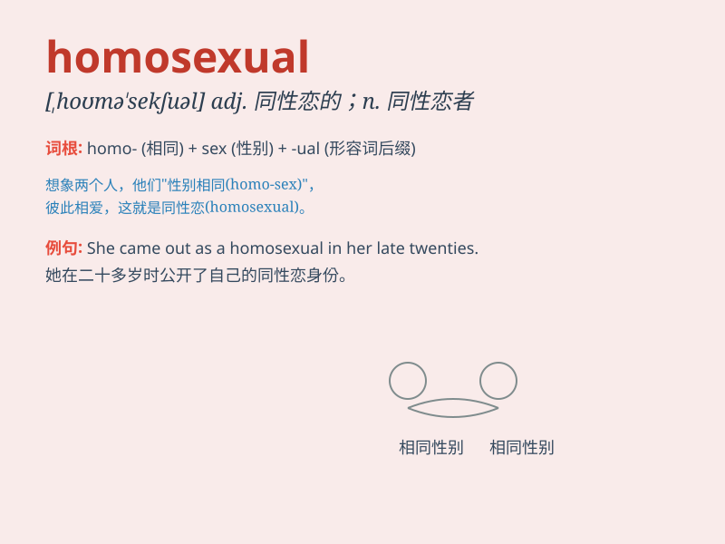

## homosexual

**英音:** _[,hɒmə(ʊ)\'sekʃʊəl; ,həʊm-; -sjʊəl]_ **美音:**
_[,homə\'sɛkʃuəl]_

**译义:** *adj.同性恋的n.同性恋*

### 短语

+ **homosexual relationship:** _同性恋关系_

+ **homosexual orientation:** _同性恋取向_

+ **homosexual couple:** _同性恋伴侣_

+ **homosexual community:** _同性恋群体_

+ **homosexual behavior:** _同性恋行为_

### 例句

#### 例句1

> **He came out as a homosexual to his family and friends.**

**中文翻译:** 他向家人和朋友公开自己是同性恋。

**单词释义:** 同性恋的

#### 例句2

> **The law should provide equal rights for homosexuals.**

**中文翻译:** 法律应该为同性恋者提供平等的权利。

**单词释义:** 同性恋者

#### 例句3

> **Homosexual relationships are becoming more accepted in
society.**

**中文翻译:** 同性恋关系越来越为社会所接受。

**单词释义:** 同性恋的

### 背诵小故事

> Once upon a time, there was a person who had special feelings for the
same gender. This person was described as homosexual. It means someone
attracted to people of the same sex.

**从前，有一个人对相同性别的人有特殊的感情。这个人就被描述为同性恋者。这个词指的是被相同性别的人所吸引的人。**

### 图义

