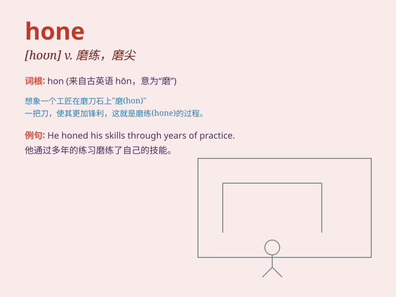

## hone

**英音:** _[həʊn]_ **美音:** _[hon]_

**译义:** *n.(细)磨(刀)石,油石,[方言]抱怨,想念vt.用磨刀石磨*

### 短语

+ **hone in:** _瞄准；聚焦；对准_

+ **hone skills:** _磨练技能_

+ **hone one\'s ability:** _磨炼某人的能力_

+ **hone the edge:** _磨利边缘_

+ **hone a theory:** _完善理论_

### 例句

#### 例句1

> **He spent years honing his skills as a pianist.**

**中文翻译:** 他花了数年时间磨练自己的钢琴演奏技巧。

**单词释义:** 磨练，提高

#### 例句2

> **The chef is honing his knife to make it sharper.**

**中文翻译:** 厨师正在磨刀，让它变得更锋利。

**单词释义:** 磨刀，使锋利

#### 例句3

> **She constantly hones her public speaking abilities.**

**中文翻译:** 她不断磨练自己的公开演讲能力。

**单词释义:** 锤炼，改进

### 背诵小故事

> A young blacksmith was constantly honing his skills. Every day, he
would sharpen his tools on the whetstone, making them perfect. Just like
that, \'hone\' means to sharpen or perfect something through practice
and effort.

**一位年轻的铁匠不断磨练他的技艺。每天，他都会在磨刀石上磨利他的工具，使其完美。就像这样，\'hone\'意味着通过练习和努力使某物变锋利或完善。**

### 图义

