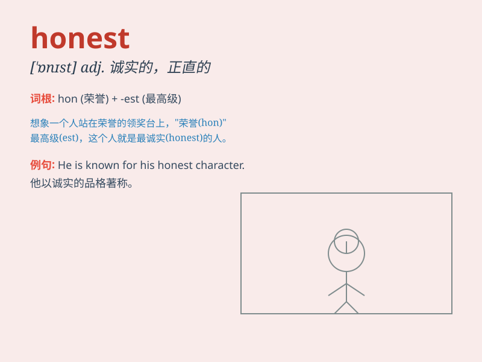

## honest

**英音:** _[\'ɒnɪst]_ **美音:** _[\'ɑnɪst]_

**译义:** *adj.诚实的,正直的*

### 短语

+ **honest mistake:** _无心之失；无意的错误_

+ **honest opinion:** _坦诚的意见；诚实的看法_

+ **be honest with:** _对\...\...坦诚_

+ **honest living:** _正当的生活；诚实的生计_

+ **honest face:** _诚实的面容_

### 例句

#### 例句1

> **He is an honest man and always tells the truth.**

**中文翻译:** 他是一个诚实的人，总是说实话。

**单词释义:** 诚实的

#### 例句2

> **To be honest, I don\'t think this plan will work.**

**中文翻译:** 说实话，我觉得这个计划行不通。

**单词释义:** 老实的；坦诚的

#### 例句3

> **She gave an honest opinion about the book.**

**中文翻译:** 她对这本书给出了诚实的意见。

**单词释义:** 诚实的；正直的

### 背诵小故事

> A little boy found a wallet on the street. He didn\'t keep the money
but gave it to the police. Everyone praised him as an honest child.
Being honest means being truthful and not stealing or cheating.

**一个小男孩在街上捡到一个钱包。他没有把钱据为己有而是交给了警察。大家都称赞他是个诚实的孩子。诚实意味着真诚，不偷不骗。**

### 图义

