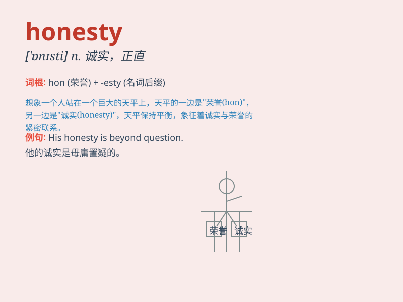

## honesty

**英音:** _[\'ɒnɪstɪ]_ **美音:** _[\'ɑnəsti]_

**译义:** *n.诚实,正直*

### 短语

+ **honesty is the best policy:** _诚实为上策_

+ **in all honesty:** _老实说；说实话_

+ **honesty of purpose:** _目的的诚实性_

+ **uphold honesty:** _维护诚实_

+ **lack of honesty:** _缺乏诚实_

### 例句

#### 例句1

> **Honesty is the best policy.**

**中文翻译:** 诚实是最好的政策。

**单词释义:** 诚实

#### 例句2

> **His honesty earned him respect.**

**中文翻译:** 他的诚实为他赢得了尊重。

**单词释义:** 诚实

#### 例句3

> **We value honesty above all else in our friends.**

**中文翻译:** 我们最看重朋友的诚实。

**单词释义:** 诚实

### 背诵小故事

> Once upon a time, there was a little boy. He found a wallet on the
street and returned it to the owner without taking a penny. His action
showed honesty. People praised him for his honesty and he felt very
happy.

**从前，有个小男孩。他在街上捡到一个钱包，一分钱没拿就归还给了失主。他的行为展现了诚实。人们称赞他的诚实，他感到非常开心。**

### 图义

