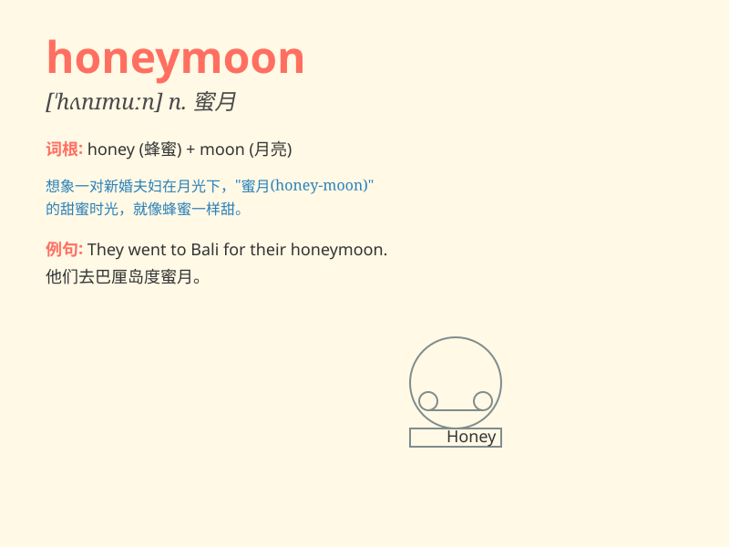

## honeymoon

**英音:** _[\'hʌnɪmuːn]_ **美音:** _[\'hʌnɪmun]_

**译义:** *n.蜜月vi.度蜜月v.度蜜月*

### 短语

+ **honeymoon period:**
_蜜月期；（新工作、新关系等的）初始的愉快时期_

+ **honeymoon suite:** _蜜月套房_

+ **go on honeymoon:** _去度蜜月_

+ **honeymoon destination:** _蜜月目的地_

+ **second honeymoon:** _第二次蜜月_

### 例句

#### 例句1

> **They went to Hawaii for their honeymoon.**

**中文翻译:** 他们去夏威夷度蜜月。

**单词释义:** 蜜月

#### 例句2

> **The honeymoon period of their marriage was very sweet.**

**中文翻译:** 他们婚姻的蜜月期非常甜蜜。

**单词释义:** 蜜月期

#### 例句3

> **After the honeymoon, they faced some challenges in their
relationship.**

**中文翻译:** 蜜月过后，他们的关系面临了一些挑战。

**单词释义:** 蜜月

### 背诵小故事

> A newly married couple went to a beautiful beach for their honeymoon.
They spent days enjoying the sun, sea and each other\'s company. It was
a sweet and unforgettable time, just like the word \'honeymoon\'
suggests.

**一对新婚夫妇去了一个美丽的海滩度蜜月。他们花了几天时间享受阳光、大海和彼此的陪伴。这是一段甜蜜且难忘的时光，正如'honeymoon'这个词所暗示的那样。**

### 图义

