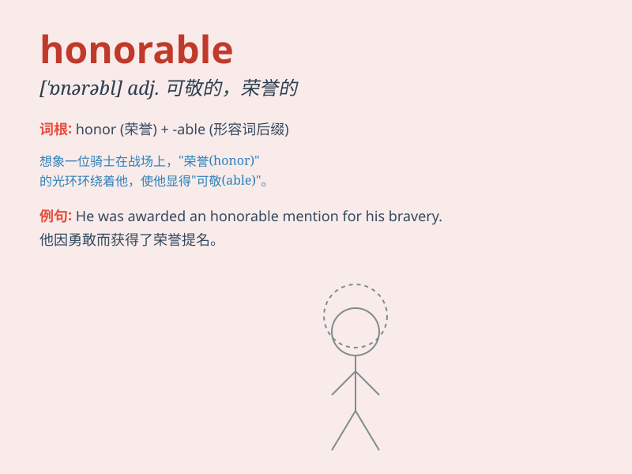

## honorable

**英音:** _[\'ɒnərəbl]_ **美音:** _[ˈɑnərəbəl]_

**译义:** *adj.可敬的,荣誉的,光荣的*

### 短语

+ **honorable mention:** _荣誉奖；优秀奖_

+ **honorable discharge:** _荣誉退伍_

+ **honorable intentions:** _高尚的意图_

+ **honorable person:** _可敬的人_

+ **honorable profession:** _光荣的职业_

### 例句

#### 例句1

> **He was an honorable man, always keeping his word.**

**中文翻译:** 他是一个可敬的人，总是信守诺言。

**单词释义:** 可敬的；值得尊敬的

#### 例句2

> **It is honorable to admit your mistakes and take responsibility
for them.**

**中文翻译:** 承认错误并承担责任是光荣的。

**单词释义:** 光荣的；荣耀的

#### 例句3

> **The honorable judge presided over the court case with fairness
and impartiality.**

**中文翻译:** 这位可敬的法官公正且不偏不倚地主持了这个法庭案件。

**单词释义:** 可敬的；高尚的

### 背诵小故事

> A young man saved a drowning child. People called him honorable
because of his brave and kind act. His honorable behavior made him a
hero in the town.

**一个年轻人救了一名溺水的孩子。人们称他是可敬的，因为他勇敢善良的行为。他可敬的行为使他成为镇上的英雄。**

### 图义

