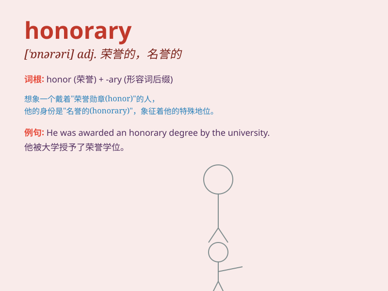

## honorary

**英音:** _[\'ɒn(ə)(rə)rɪ]_ **美音:** _[\'ɑnərɛri]_

**译义:** *adj.荣誉的,名誉的,(债务的)道义上的*

### 短语

+ **honorary degree:** _荣誉学位_

+ **honorary president:** _名誉主席_

+ **honorary membership:** _荣誉会员资格_

+ **honorary doctorate:** _荣誉博士学位_

+ **honorary citation:** _荣誉嘉奖_

### 例句

#### 例句1

> **He was awarded an honorary degree by the university.**

**中文翻译:** 他被这所大学授予了荣誉学位。

**单词释义:** 荣誉的；名誉的

#### 例句2

> **She holds an honorary position in the organization.**

**中文翻译:** 她在这个组织中担任一个名誉职位。

**单词释义:** 荣誉的；名誉的

#### 例句3

> **The honorary chairman attended the event.**

**中文翻译:** 名誉主席出席了活动。

**单词释义:** 名誉的

### 背诵小故事

> A young artist was awarded an honorary title for his outstanding
paintings. People respected him a lot. The honorary title made him feel
proud and determined to create more masterpieces.

**一位年轻的艺术家因其出色的画作被授予荣誉称号。人们非常尊重他。这个荣誉称号让他感到自豪，并决心创作更多的杰作。**

### 图义

